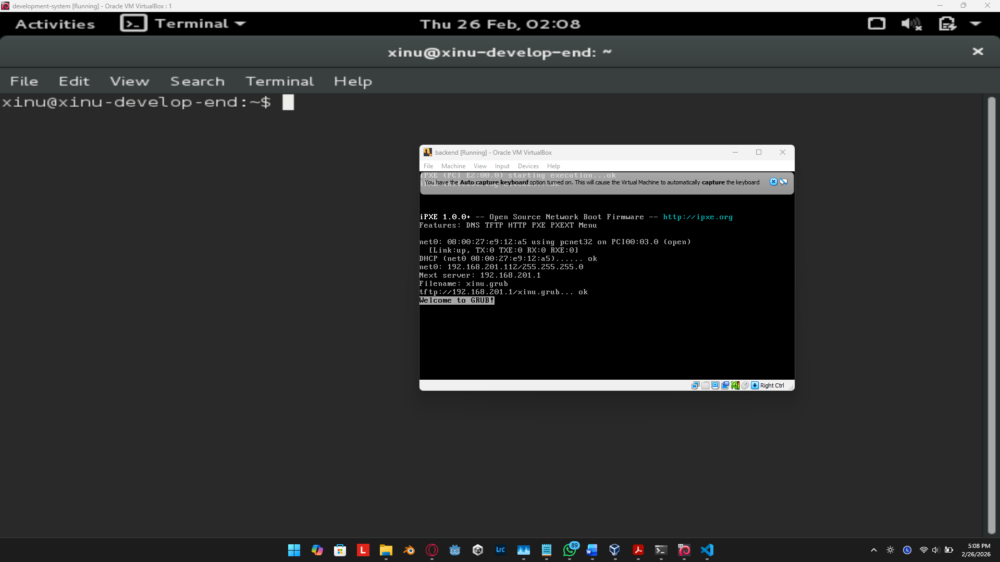

# <h1 align="center">Laporan Praktikum Modul 1   Instalasi Virtual Machine Box dan Sourcetrail</h1>

Haikal Fadhilah Mufid - 2311104027

## Dasar Teori

Instalasi Virtual Machine Box dan Sourcetrail

Tools yang digunakan pada praktikum minggu pertama adalah:

- Oracle VM Virtual Box
- Xinu OS
- Ubuntu
- Sourcetrail

## Guided

## Referensi

1. https://en.wikipedia.org/wiki/Data_structure 