# <h1 align="center">Laporan Praktikum Modul 2  Intaslasi Xinu</h1>

Haikal Fadhilah Mufid - 2311104027

## Dasar Teori

Apa itu Xinu? Xinu adalah sistem operasi kecil yang dirancang untuk tujuan pendidikan, khususnya buat belajar konsep dasar sistem operasi seperti manajemen prose, komunikasi antar proses, interupt handling dan manajemen memori.

Ya intinya buat belajar lah ya

## Guided

Instalasi VM
Persiapan
1. Jalankan Oracle VM Virtualbox yang sudah terinstall pada device masing-masing.
2. Ekstrak xinu-vbox-appliances.tar.gz. menggunakan aplikasi zip/winrar. Hasil ektraksi adalah dua 
buah file yaitu: development-system.ova dan backend.ova.
a. File development-system.ova merupakan image Linux Debian yang berisi source code 
Xinu, compiler untuk mengcompile Xinu, DHCP server dan TFTP server. 
b. File backend.ova merupakan komputer virtual yang akan menjalankan Xinu. File 
berektensi .ova adalah file image virtual machine (vm).
File-file .ova tersebut nanti akan diimport sehingga menjadi virtual machine. Pada praktikum ini,
akan lebih banyak menggunakan vm development-system daripada vm backend

Import dan Setting Development-System VM
1. Jalankan VirtualBox.
2. File -> Import Appliance.
3. Pilih development-system.ova hasil dari tahap sebelumnya.
4. Next (tunggu hingga selesai). Lama waktu tunggu tergantung dari spesifikasi komputer.
5. Akan muncul vm development-system pada panel sebelah kiri. Kemudian pilih “Settings”
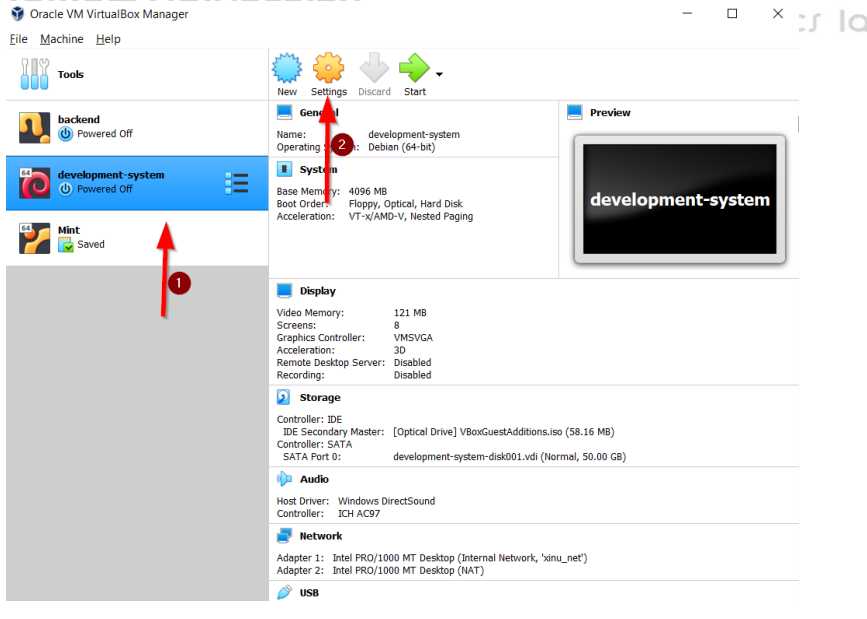

6. Plih menu “Network” dan ubah setting menjadi seperti gambar di bawah ini:
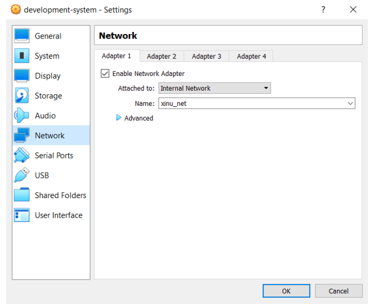

7. Pilih menu “Serial Ports” dan ubah setting menjadi seperti gambar di bawah ini:
Perhatikan “Connect to existing pipe/socket” tidak dipilih
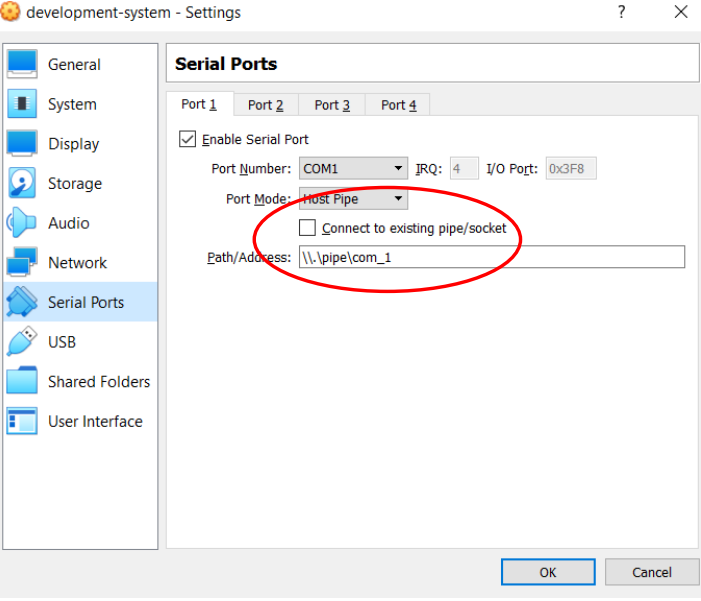

8. Ubah menu “Display”
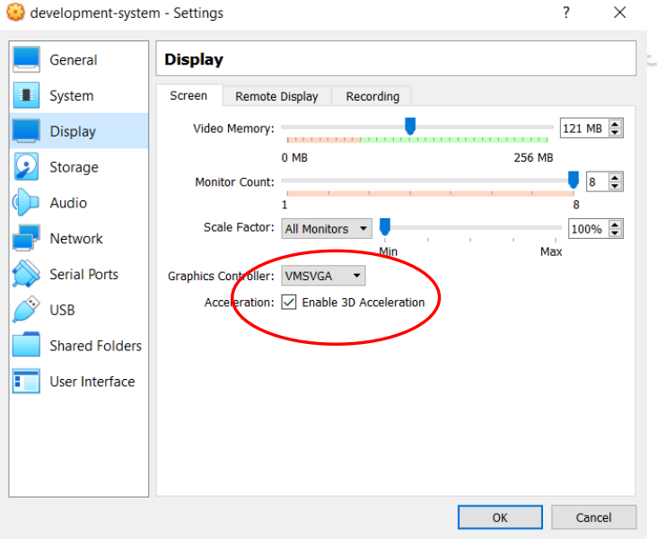

1. 2Import dan Setting Backend VM
Jalankan VirtualBox.
File -> Import Appliance.
Pilih backend.ova hasil dari tahap sebelumnya.
Next (tunggu hingga selesai).
Akan muncul vm backend pada panel sebelah kiri. Pilih “Settings”
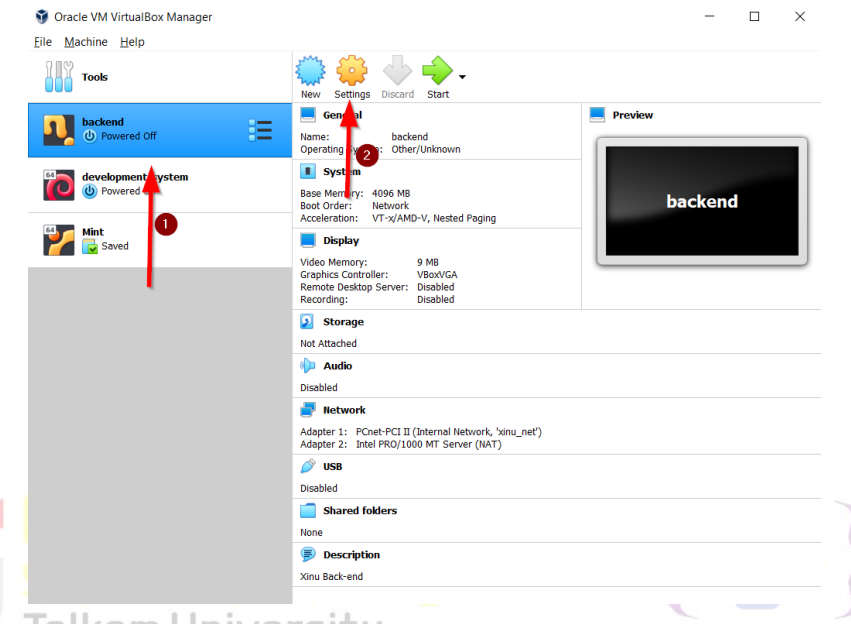

2. kemudian pilih network, lakukan sama seperti yang dilakukan seperti diatas.

3. Pilih menu “Serial Ports” dan ubah setting menjadi seperti gambar di bawah ini
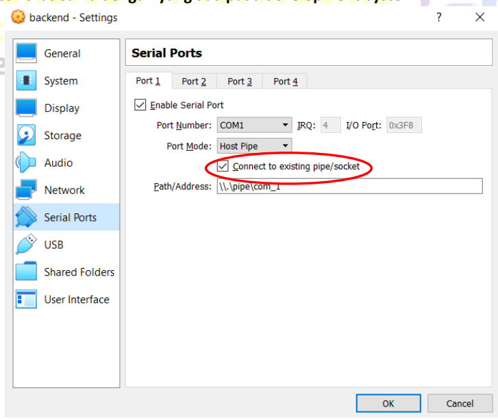

Kemudian dibawah ini adalah pengerjaan modul 2 sesuai dengan ketentuan Asprak
1. Sesuai perintah, kita akan me rename development system dan juga backend, dan gambar dibawah adalah gambar keduanya sudah di rename.
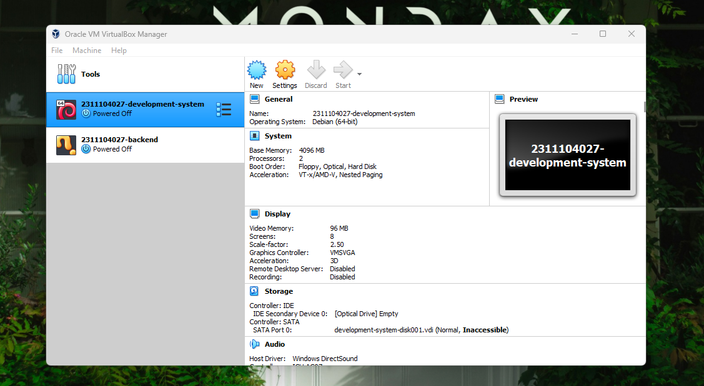

2. mengganti port 
development-system
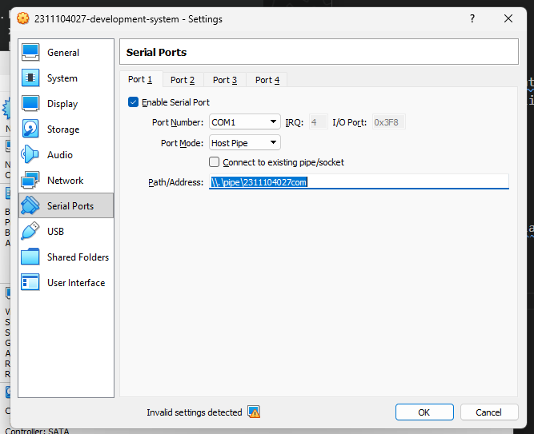

backend
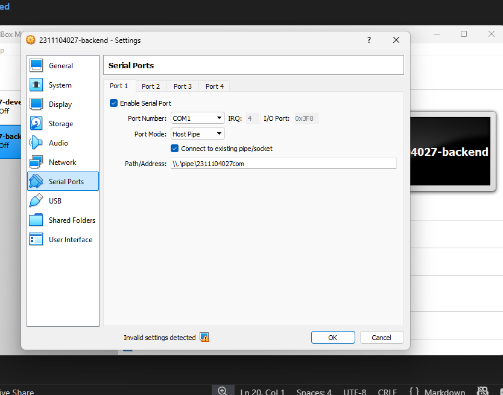

3. kemudian mengganti password, dengan gambar dibawah ini, kenapa password unchanged? karena pas ganti pertama lupa saya screenshoot.
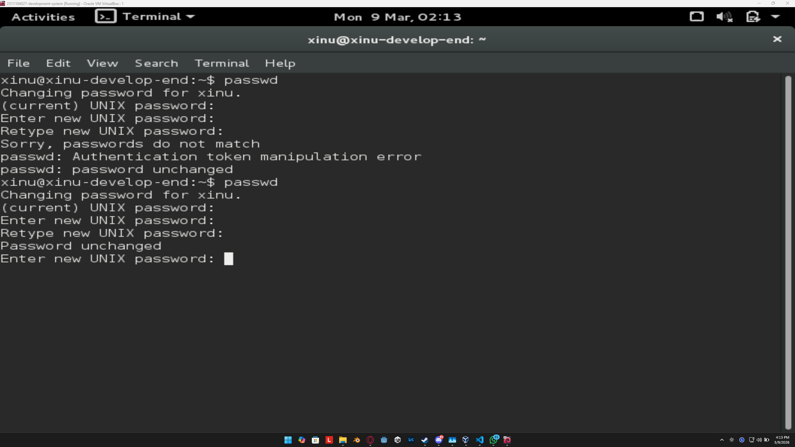

4. menjalankan VM dan sourcetrail
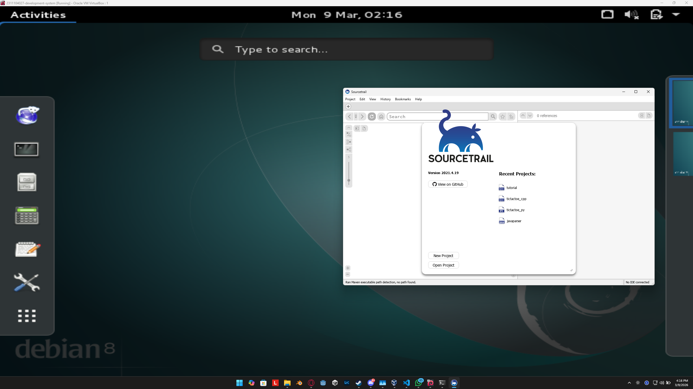
## Referensi

1. https://en.wikipedia.org/wiki/Data_structure 
2. https://telkomuniversityofficial-my.sharepoint.com/personal/maghaz_student_telkomuniversity_ac_id/_layouts/15/onedrive.aspx?id=%2Fpersonal%2Fmaghaz_student_telkomuniversity_ac_id%2FDocuments%2F2026%2F00%2E%20Modul%20Praktikum%20Sistem%20Operasi%20SE%202526-2%2Epdf&parent=%2Fpersonal%2Fmaghaz_student_telkomuniversity_ac_id%2FDocuments%2F2026&ga=1
3. Chatgpt (untuk tutorial mengganti password)