# <h1 align="center">Laporan Praktikum Modul 3   Eksplorasi Xinu</h1>

Haikal Fadhilah Mufid - 2311104027

---

## Dasar Teori

Xinu adalah shell sederhana yang memungkinkan user untuk menjalankan perintah untuk berinteraksi dengan sistem. Perintah tersebut digunakan untuk melakukan pengujian fungsi kernel, melihat status kernel, dll.

Dan pada modul kali ini, kita akan mempelajari Xinu melalui eksplorasi Xinu, di mana kita akan mempelajari konsep dasar sistem operasi. Kita sudah mengakses Xinu pada pertemuan kemarin di kelas, dan saat ini adalah saatnya untuk mengeksplorasi.

---

## Guided

### 1. Perintah Xinu
Setelah mengetik `help` di Terminal:

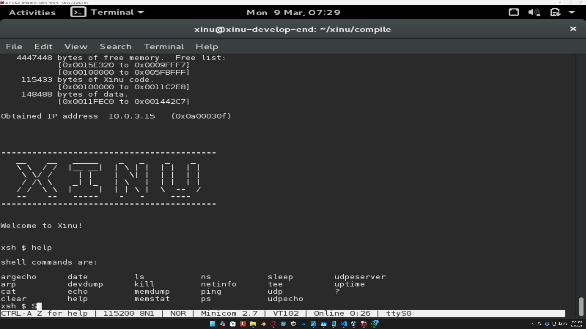

Terdapat **23 command** pada Xinu.

**a. command pertama adalah `argecho`**

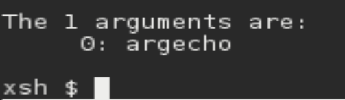  
Digunakan untuk menampilkan argumen dari pengguna.

**b. command kedua adalah `arp`**

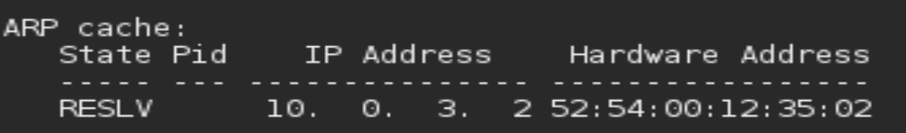  
Fungsinya adalah untuk menampilkan IP address.

**c. command `cat`**  
Digunakan untuk membaca file. Karena saya tidak memasukkan nama file yang akan dibaca, jadinya tidak muncul apa-apa.

**d. command `clear`**  
Untuk membersihkan terminal dari perintah-perintah yang sudah dijalankan.

**e. command `date`**

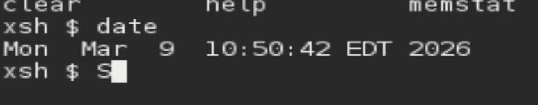  
Untuk menampilkan tanggal, hari, dan waktu.

**f. command `devdump`**

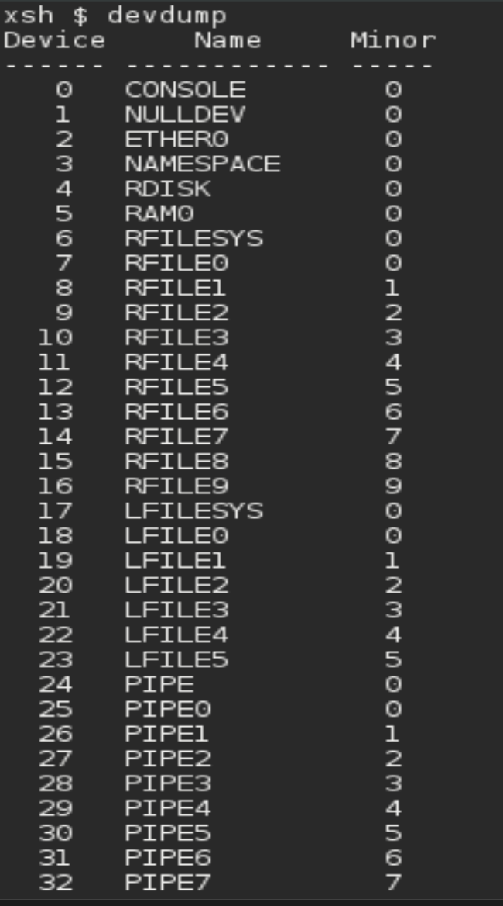  
Digunakan untuk menampilkan informasi tabel device yang ada pada sistem.

**g. command `echo`**

  
Digunakan untuk menampilkan teks. Jika hanya menulis `echo`, tidak akan muncul apa-apa.

**h. command `help`**

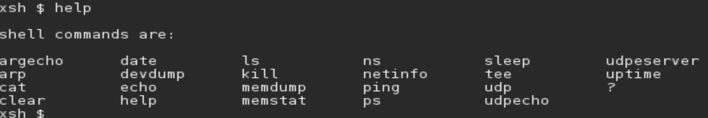  
Berfungsi untuk menampilkan jenis-jenis command yang tersedia pada Xinu.

**i. command `ls`**  
Digunakan untuk menampilkan direktori yang ada.

**j. command `kill`**  
Digunakan untuk memberhentikan suatu proses.

**k. command `memdump`**

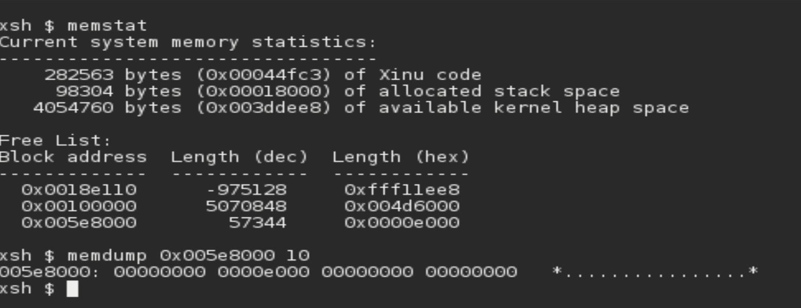  
Digunakan untuk melihat isi RAM pada alamat tertentu secara langsung. Sebelum menggunakannya, kita harus menggunakan `memstat` dulu untuk melihat alamat dan panjangnya.

**l. command `memstat`**

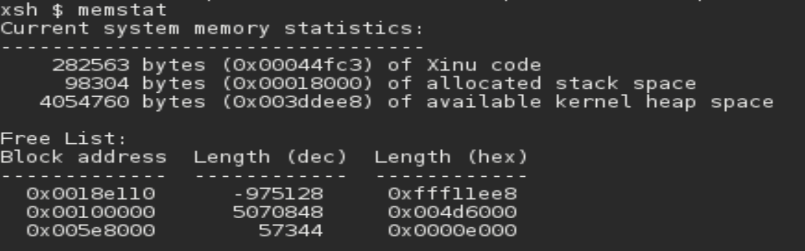  
Digunakan untuk menampilkan alamat memori yang digunakan pada sistem Xinu.

**m. command `ns`**

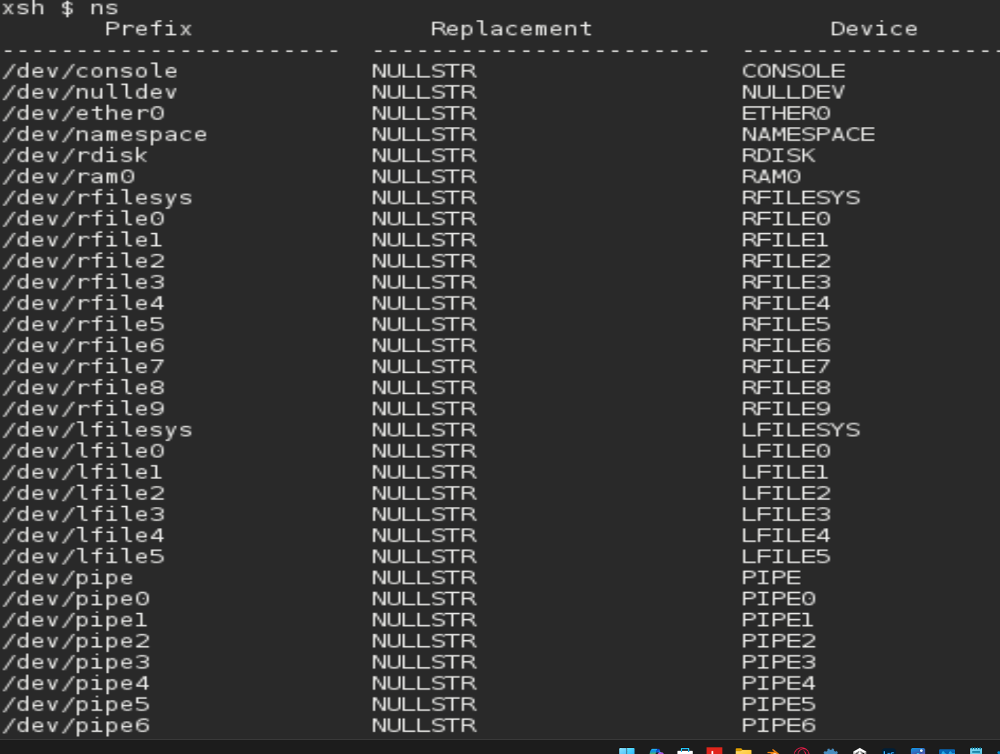  
`ns` atau nameserver digunakan untuk melihat informasi server yang digunakan oleh sistem jaringan.

**n. command `netinfo`**

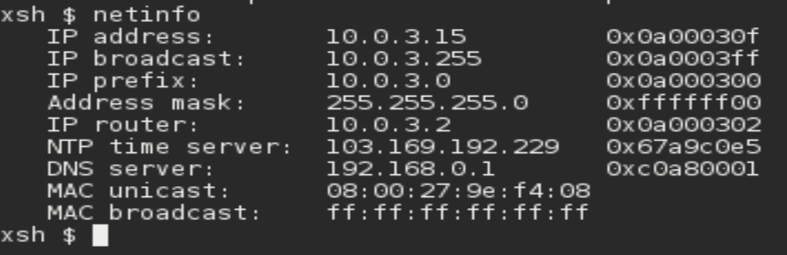  
Digunakan untuk melihat IP address dari device kita, termasuk IP router, server DNS, dll.

**o. command `ping`**

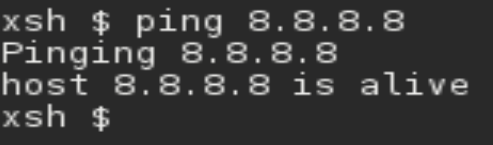  
Digunakan untuk melihat ping, sama seperti di CMD pada Windows.

**p. command `ps`**

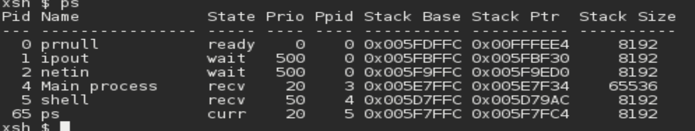  
Digunakan untuk melihat data proses pada sistem.

**q. command `sleep`**  
Digunakan untuk memberhentikan sementara eksekusi proses selama waktu tertentu.

**r. command `tee`**  
Digunakan untuk membaca input dari pengguna.

**s. command `udp`**

  
Digunakan untuk mengirim paket data dan menggunakan protokol UDP pada jaringan. Harus ada device lain yang menggunakan jaringan yang sama.

**t. command `udpecho`**

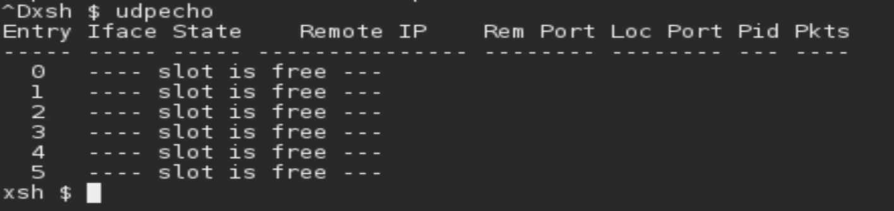  
Digunakan untuk mengetes kembali alat uji coba untuk memastikan bahwa protokol jaringan, khususnya UDP, berfungsi dengan benar.

**u. command `udpserver`**  
Digunakan untuk menjalankan server UDP di Xinu yang siap menerima paket data dari klien (melalui IP dan port tertentu).

**v. command `uptime`**

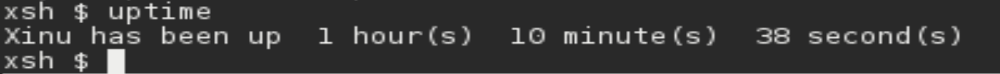  
Digunakan untuk melihat sudah berapa lama user menggunakan Xinu.

**w. command `?`**  
Sama seperti `help`, digunakan untuk menampilkan daftar command yang dapat digunakan di terminal.

---

### 2. Jawablah pertanyaan-pertanyaan berikut

- **Berapa jumlah perintah pada Xinu?**  
  Terdapat 23 perintah pada Xinu.

- **Sebutkan 2 perintah yang mempunyai fungsi sama!**  
  `help` dan `?` adalah perintah yang sama-sama menampilkan list command pada Xinu.

- **Berapa IP address Xinu?**  
  10.0.3.15

- **Perintah apa yang digunakan untuk mengetahui IP address?**  
  `netinfo`

- **Berapa IP DNS server yang digunakan oleh Xinu?**  
  192.168.0.1

- **Terdapat berapa proses yang sedang berjalan pada Xinu?**  
  6 proses

- **Proses apa yang mempunyai prioritas paling rendah?**  
  `recv` dan `wait`

- **Proses apa yang mempunyai ukuran paling besar?**  
  `ready` dan `current`

- **Proses apa yang berada dalam state current?**  
  `ps` (karena sedang digunakan)

- **Proses apa yang berada dalam state suspend?**  
  Tidak ada yang berada dalam state suspend

- **Berapa PID (Process ID) dari Main process?**  
  3

---

## Referensi

1. https://medium.com/@stevenindramer08/perintah-dasar-pada-xinu-os-523ce6f23e31  
2. ChatGPT dan Gemini (untuk membantu menyelesaikan masalah command yang saya tidak tahu awalnya seperti memdump, dll.)  
3. https://telkomuniversityofficial-my.sharepoint.com/personal/maghaz_student_telkomuniversity_ac_id/_layouts/15/onedrive.aspx?id=%2Fpersonal%2Fmaghaz_student_telkomuniversity_ac_id%2FDocuments%2F2026%2F00%2E%20Modul%20Praktikum%20Sistem%20Operasi%20SE%202526-2%2Epdf&parent=%2Fpersonal%2Fmaghaz_student_telkomuniversity_ac_id%2FDocuments%2F2026&ga=1