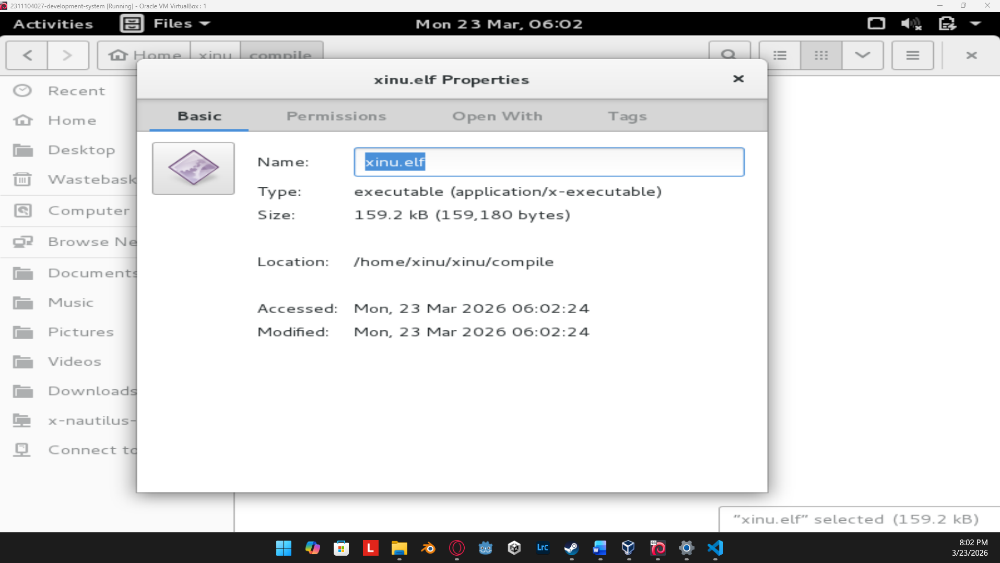
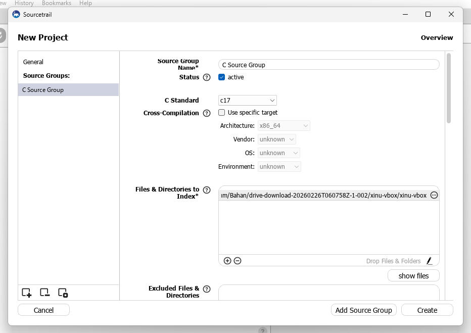
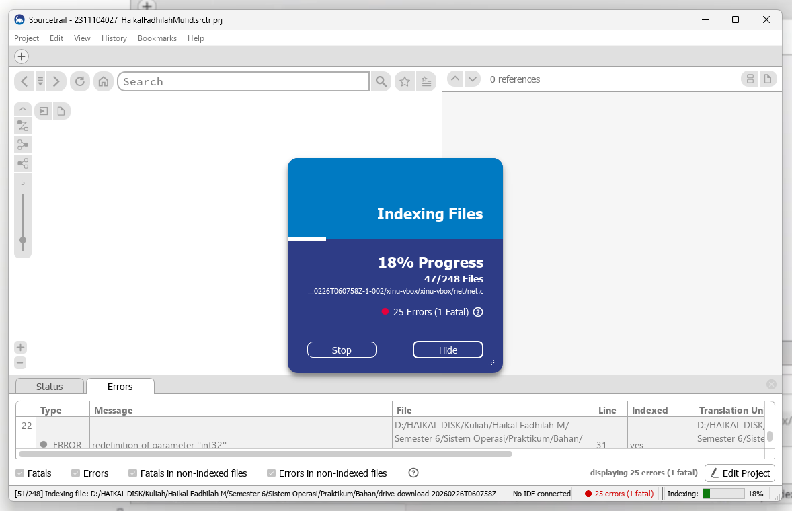
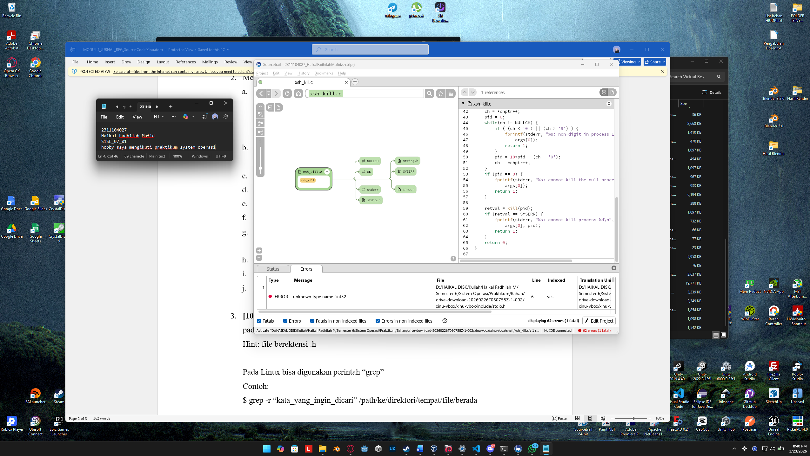
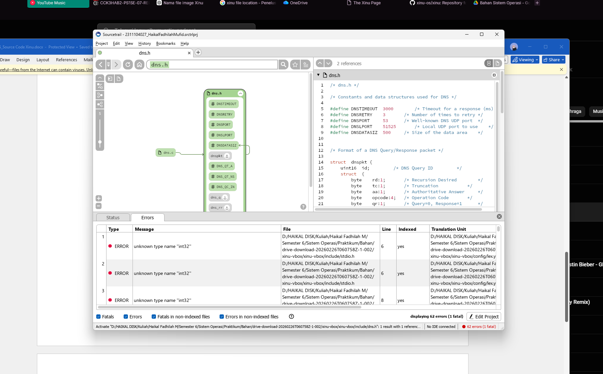
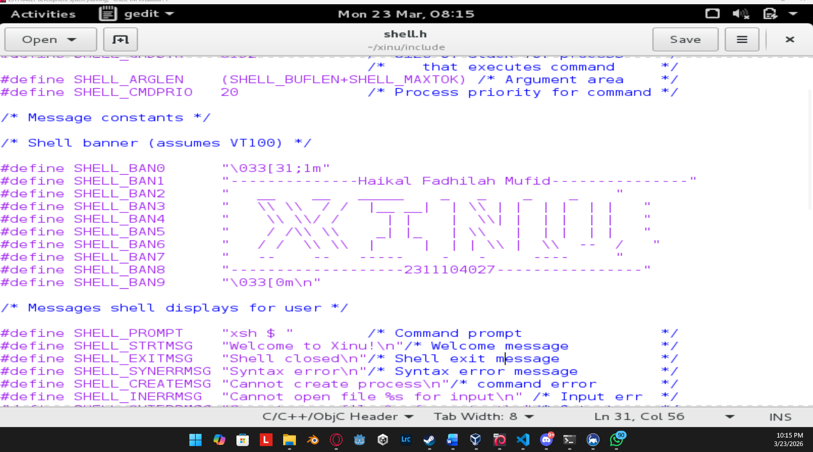
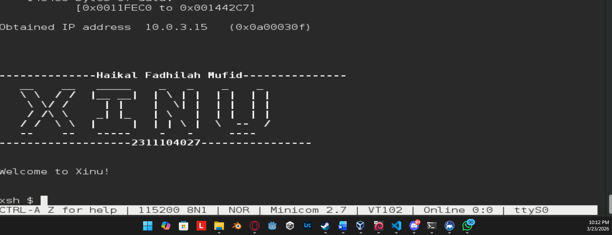

# <h1 align="center">Laporan Praktikum Modul 4    Membaca Source Code Xinu </h1>

Haikal Fadhilah Mufid - 2311104027

## Dasar Teori

Xinu ditujukan untuk sistem embedded, oleh karena itu Xinu mengikuti paradigma crossdevelopment. Pada paradigma cross-development, developer (programmer) akan menggunakan 
komputer standar pada umumnya (yaitu: PC atau laptop) dan memakai sistem operasi biasa seperti 
Linux atau Windows. Pada komputer tersebut, developer akan membuat kode, mengedit kode, crosscompile dan cross-link Xinu. Output dari cross-development adalah file image.

## Guided
Jurnal

1.	[10 Poin] Apa nama image yang dihasilkan setelah melakukan kompilasi pada Xinu? Berapa ukuran file tersebut? Ada pada folder apa file image tersebut? 

Jawaban: 
ukuran dari image yang dihasilkan (xinu.elf) adalah 159.2 kb

2. 	Membaca source code Xinu
a.	Cek aplikasi bernama Sourcetrail di PC. Jika belum ada, download SourceTrail pada (DOWNLOAD SOURCETRAIL). SourceTrail adalah software untuk mengeksplorasi source code. Programmer yang bagus lebih banyak membaca kode daripada menulis kode
b.	Download file source code xinu yang tersedia pada attempt jurnal praktikum di LMS
c.	Jalankan SourceTrail
d.	Project  New Project
e.	Isi nama project xinu dan pilih lokasi project di manapun
f.	Add Source Groups, pilih C, lalu pilih Empty C Source Group
g.	File & Directories to Index: masukkan semua folder Xinu (yang sebelumnya telah di download)
h.	Include Paths: …/xinu/include
i.	Create
j.	Silahkan eksplorasi source code Xinu

selipan screenshoot saat menggunakan SourceTrail 

ini adalah sourceTrail ketika xinu sudah bisa diotak atik source codenya

3. Carilah struktur data dari proses pada Xinu OS. Struktur data proses ada pada file apa? Informasi apa saja yang disimpan dalam struktur data tersebut? 
Hint: file berektensi .h 

Pada Linux bisa digunakan perintah “grep”
Contoh:
$ grep -r “kata_yang_ingin_dicari” /path/ke/direktori/tempat/file/berada

4. Mengubah welcome banner pada Xinu

## Referensi

1. https://en.wikipedia.org/wiki/Data_structure 
2. Modul 4 Sistem Operasi
3. Gemini (untuk menemukan file)
4. Link youtube dari Asprak