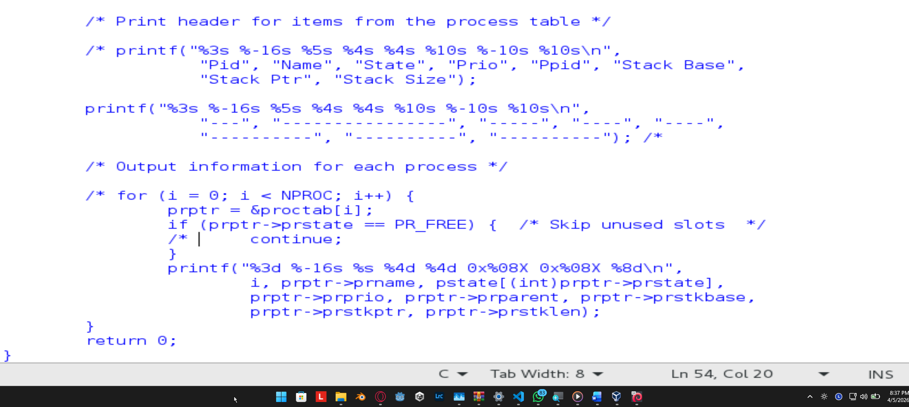
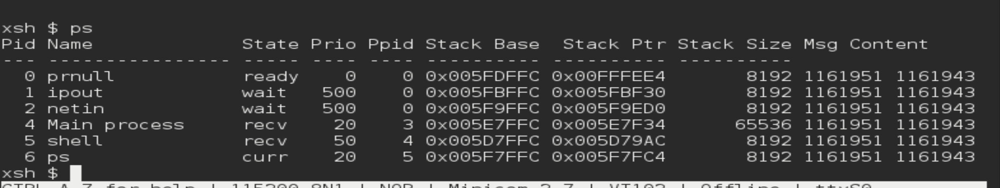
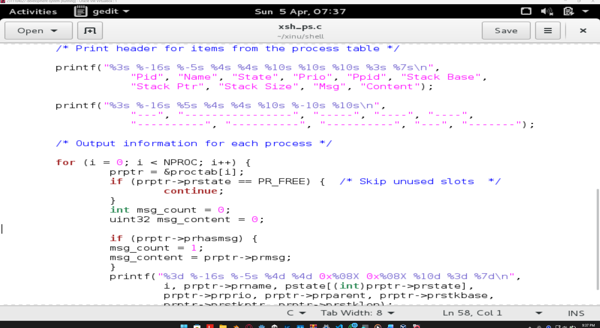
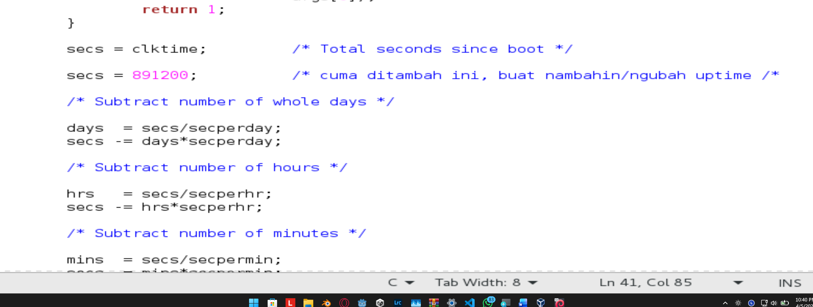
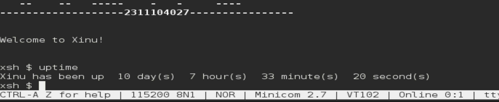

# <h1 align="center">Laporan Praktikum Modul 5   Eksplorasi Proses</h1>

Haikal Fadhilah Mufid / 2311104027

## Dasar Teori

Proses adalah program yang sedang dieksekusi, dan sistem operasi mengelolanya menggunakan struktur data yang disebut process table. Setiap proses direpresentasikan sebagai satu entri dalam tabel tersebut, yang dibuat saat proses diciptakan dan dihapus saat proses diterminasi.

Pada sistem operasi Xinu, process table diimplementasikan dalam bentuk array global proctab[], yang dapat diakses oleh seluruh fungsi dalam kernel. Setiap elemen array ini berisi Process Control Block (PCB) yang direpresentasikan oleh struktur struct procent. PCB menyimpan informasi penting proses seperti nama, status, dan prioritas.

Pengelolaan proses di Xinu dilakukan dengan memanipulasi isi dari struct procent. Setiap proses diidentifikasi menggunakan Process ID (PID), yang secara implisit merupakan indeks dari array proctab[]. Dengan demikian, akses terhadap proses dilakukan melalui indeks array tersebut, tanpa perlu menyimpan ID secara eksplisit dalam struktur data.

## Guided

1.  a. 8 Proses
    b. 16 karakter 
    c. Nilai Prioritas awal saat proses dibuat ditentukan oleh parameter saat pemanggilan fungsi create(), jadinya tidak ada nilai default tetap.
    d. Total state pada Xinu ada 6
        - PR_FREE
        - PR_CURR
        - PR_READY
        - PR_RECV
        - PR_SLEEP
        - PR_SUSP

2. 

3. berikut adalah hasil dari ubahan pada file xsh_ps.c
   

   berikut adalah ubahan kode pada filenya
   

4. berikut adalah ubahan kode pada filenya, hanya menambah secs kemudian input angka dalam satuan seconds
    

   dan ini hasilnya
    
## Referensi

1. https://en.wikipedia.org/wiki/Data_structure
2. chatGPT (fixing issue pada soal nomor 3, soalnya bingung cuy)
3. https://www.youtube.com/watch?v=zABT2rGYfAc
4. https://telkomuniversityofficial-my.sharepoint.com/personal/maghaz_student_telkomuniversity_ac_id/_layouts/15/onedrive.aspx?id=%2Fpersonal%2Fmaghaz_student_telkomuniversity_ac_id%2FDocuments%2F2026%2F00%2E%20Modul%20Praktikum%20Sistem%20Operasi%20SE%202526-2%2Epdf&parent=%2Fpersonal%2Fmaghaz_student_telkomuniversity_ac_id%2FDocuments%2F2026&ga=1