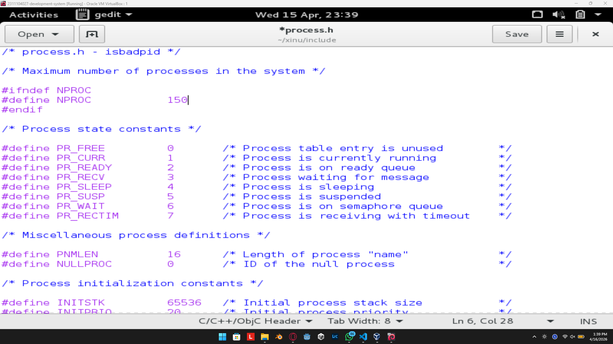
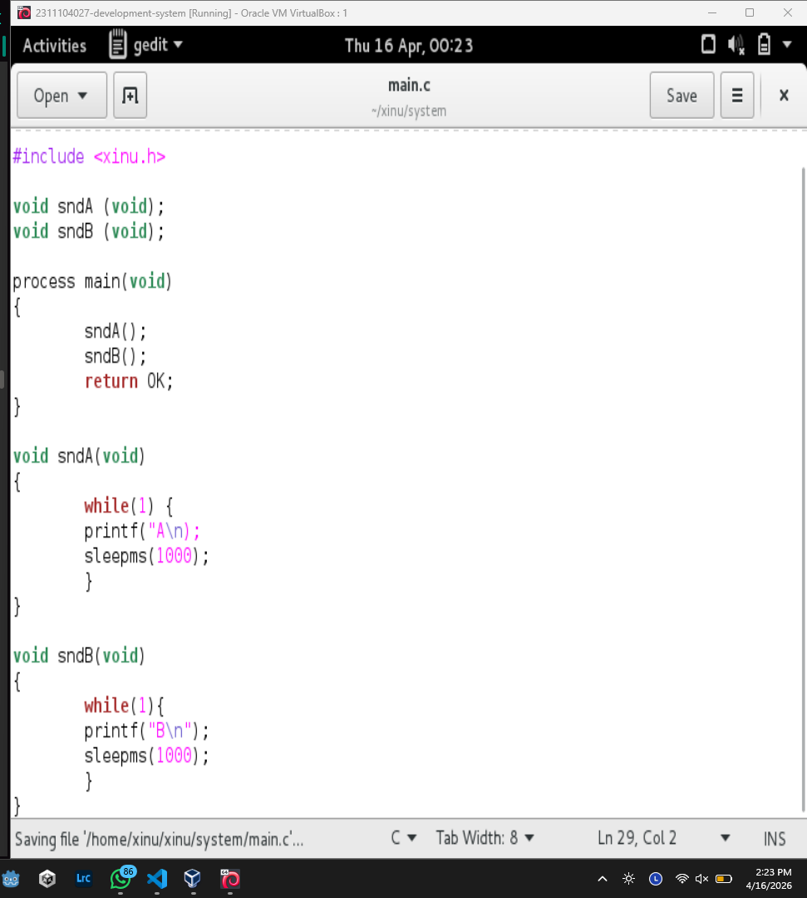
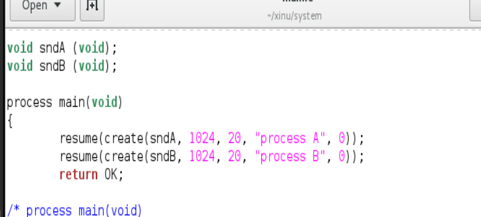

# <h1 align="center">Laporan Praktikum Modul 6   Proses Sekuensial dan Konkuren</h1>

NAMA - NIM

## Dasar Teori

materi ini menjelaskan bahwa secara sederhana program komputer awalnya dipahami berjalan secara sekuensial, yaitu mengeksekusi instruksi satu per satu secara berurutan dalam satu waktu. Namun, sistem operasi modern memperkenalkan konsep concurrent processing yang memungkinkan beberapa proses tampak berjalan secara bersamaan, baik melalui parallelism pada multi-core CPU maupun melalui teknik multitasking pada single-core yang menciptakan ilusi eksekusi bersamaan.

Untuk mewujudkan hal tersebut, sistem operasi menggunakan mekanisme seperti multiprogramming atau interleaving, di mana CPU berpindah-pindah secara cepat antar proses dalam interval waktu sangat singkat sehingga terlihat seolah berjalan paralel. Dalam praktiknya, terdapat dua pendekatan utama yaitu timesharing yang membagi waktu eksekusi secara merata, dan realtime yang memberikan prioritas berbeda sesuai kebutuhan waktu proses.

Dalam konteks program, eksekusi sekuensial berarti fungsi dijalankan secara berurutan sehingga jika satu fungsi tidak pernah selesai, fungsi lain tidak akan dieksekusi. Sebaliknya, pada program konkuren, beberapa proses dapat dibuat dan dijalankan secara independen oleh sistem operasi, sehingga memungkinkan beberapa tugas berjalan secara bergantian atau bersamaan sesuai dengan mekanisme penjadwalan CPU.

## Guided

1. mengubah proses menjadi 150

2. 

3. bagian konkuren tinggal ditambah lagi bagian main process nya

4. 
process main(void) {

    pid32 pid_prod = create(produser, 1024, 20, "produser", 0);
    pid32 pid_kons = create(konsumer, 1024, 20, "konsumer", 0);
    
    resume(pid_prod);
    resume(pid_kons);
    
    return OK;
}

## Referensi

1. https://en.wikipedia.org/wiki/Data_structure 
2. https://telkomuniversityofficial-my.sharepoint.com/personal/maghaz_student_telkomuniversity_ac_id/_layouts/15/onedrive.aspx?id=%2Fpersonal%2Fmaghaz_student_telkomuniversity_ac_id%2FDocuments%2F2026%2F00.+Modul+Praktikum+Sistem+Operasi+SE+2526-2.pdf&parent=%2Fpersonal%2Fmaghaz_student_telkomuniversity_ac_id%2FDocuments%2F2026&ga=1
