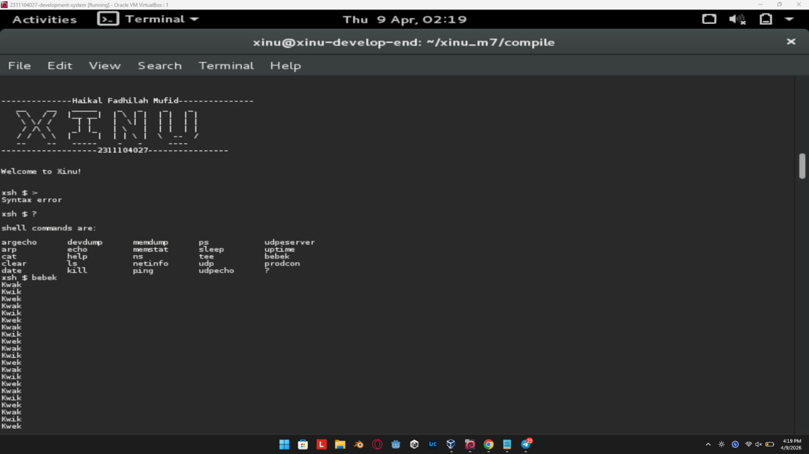
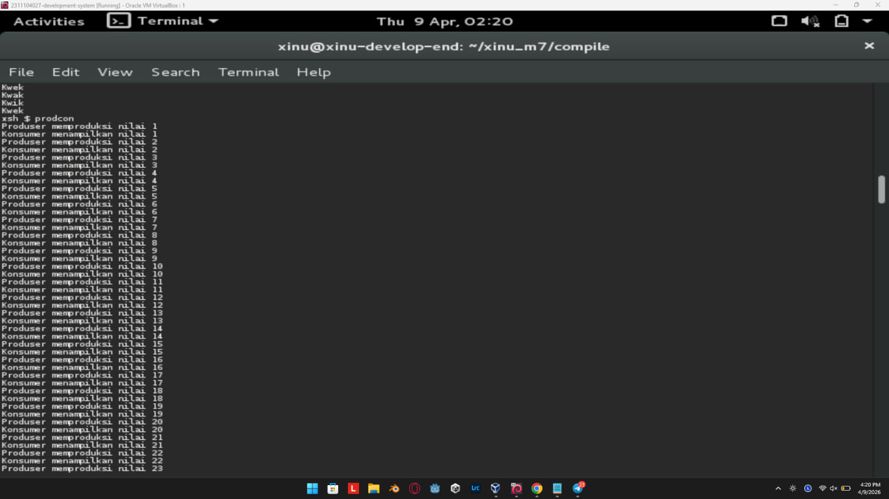
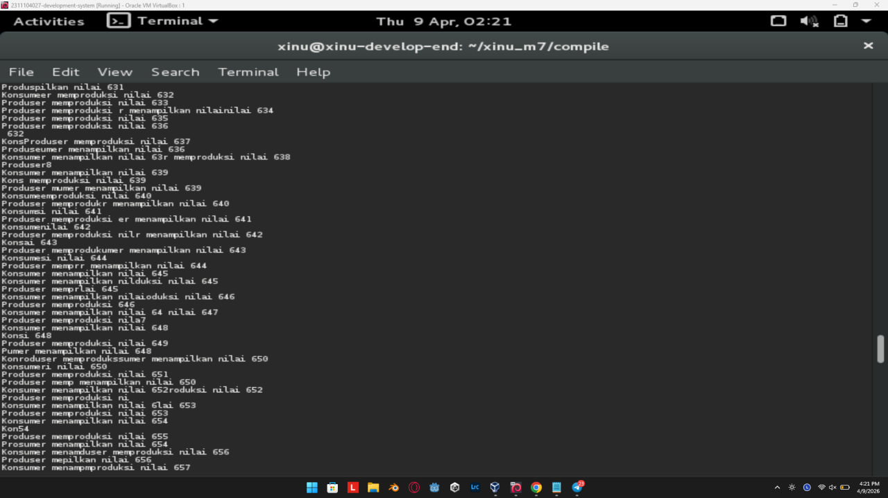
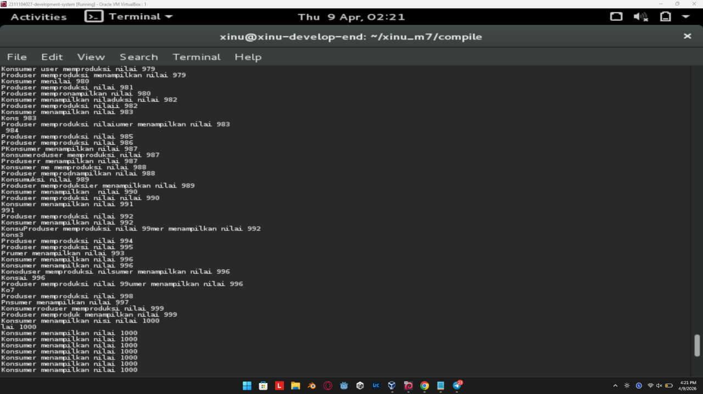

# <h1 align="center">Laporan Praktikum Modul 7   Semaphore</h1>

Haikal Fadhilah Mufid - 2311104027

## Dasar Teori

Semaphore merupakan salah satu mekanisme sinkronisasi dalam sistem operasi yang digunakan untuk mengatur akses terhadap sumber daya bersama agar tidak terjadi konflik (race condition). Dalam penggunaannya, terdapat tiga operasi utama pada semaphore, yaitu inisiasi, wait, dan signal.

Operasi inisiasi digunakan untuk memberikan nilai awal pada semaphore, yang biasanya merepresentasikan jumlah sumber daya yang tersedia. Selanjutnya, operasi wait (sering juga disebut P) berfungsi untuk mengurangi nilai semaphore. Jika nilai semaphore lebih besar dari nol, proses dapat melanjutkan eksekusi. Namun jika bernilai nol, proses akan ditunda (blocking) sampai sumber daya tersedia.

Sebaliknya, operasi signal (atau V) digunakan untuk menambah nilai semaphore, yang menandakan bahwa sumber daya telah dilepaskan oleh suatu proses. Operasi ini juga dapat membangunkan proses lain yang sebelumnya tertunda agar dapat melanjutkan eksekusi. Dengan ketiga operasi ini, semaphore mampu menjaga sinkronisasi dan mencegah akses bersamaan yang tidak terkontrol.

## Guided

## Referensi

1. https://en.wikipedia.org/wiki/Data_structure 
2. Praktikum Kelas
3. https://telkomuniversityofficial-my.sharepoint.com/personal/maghaz_student_telkomuniversity_ac_id/_layouts/15/onedrive.aspx?id=%2Fpersonal%2Fmaghaz_student_telkomuniversity_ac_id%2FDocuments%2F2026%2F00%2E%20Modul%20Praktikum%20Sistem%20Operasi%20SE%202526-2%2Epdf&parent=%2Fpersonal%2Fmaghaz_student_telkomuniversity_ac_id%2FDocuments%2F2026&ga=1