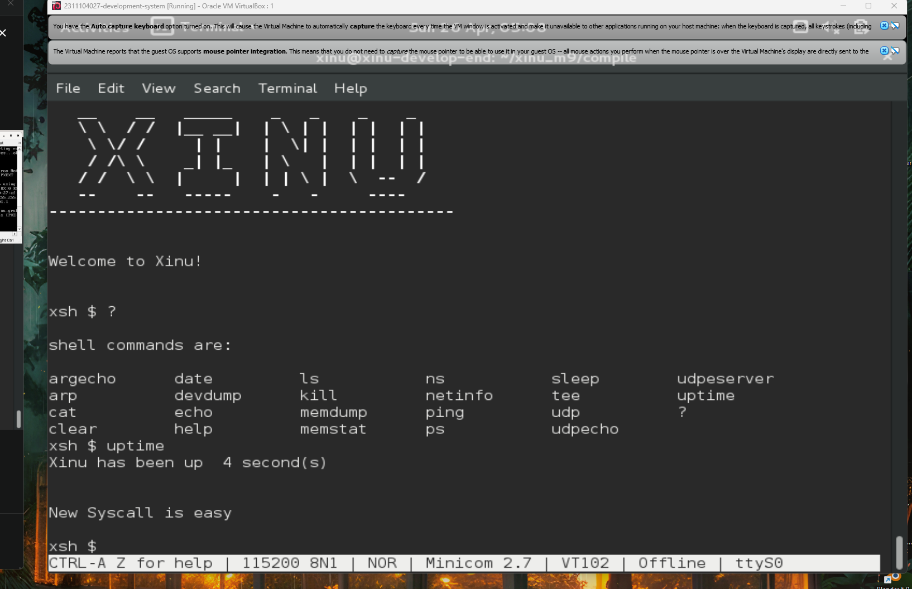

# <h1 align="center">Laporan Praktikum Modul 9   Syscall</h1>

Haikal Fadhilah Mufid - 2311104027/p>

## Dasar Teori

System call (syscall) merupakan mekanisme fundamental dalam Sistem Operasi yang berfungsi sebagai antarmuka resmi antara program pengguna (user space) dengan kernel sistem operasi (kernel space). Melalui syscall, suatu proses dapat meminta layanan yang tidak dapat diakses secara langsung, seperti manajemen berkas, pengelolaan memori, komunikasi antar proses, serta operasi perangkat keras. Ketika sebuah program memerlukan layanan tersebut, ia tidak berinteraksi langsung dengan perangkat keras atau kernel, melainkan memanggil syscall yang telah disediakan oleh sistem operasi.

## Guided

berikut merupakan syscall yang sudah dibuat berdasarkan yang diajarkan asprak.

## Referensi

1. https://en.wikipedia.org/wiki/Data_structure (diakses blablabla)
2. https://telkomuniversityofficial-my.sharepoint.com/personal/maghaz_student_telkomuniversity_ac_id/_layouts/15/onedrive.aspx?id=%2Fpersonal%2Fmaghaz_student_telkomuniversity_ac_id%2FDocuments%2F2026%2F00%2E%20Modul%20Praktikum%20Sistem%20Operasi%20SE%202526-2%2Epdf&parent=%2Fpersonal%2Fmaghaz_student_telkomuniversity_ac_id%2FDocuments%2F2026&ga=1