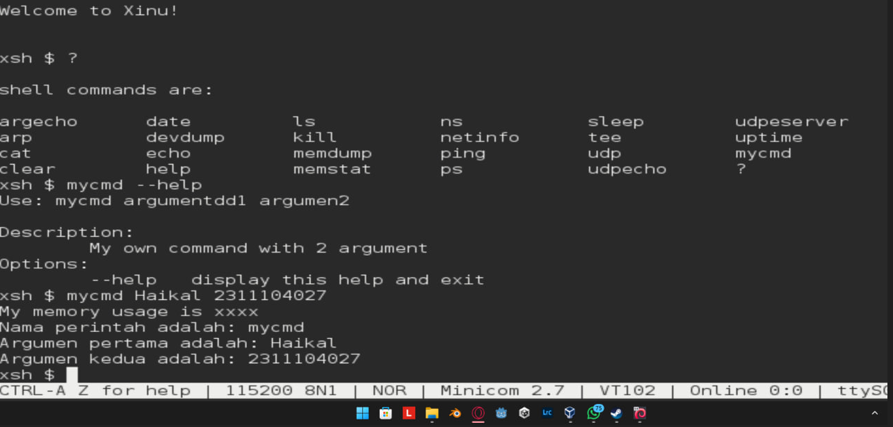

# <h1 align="center">Laporan Praktikum Modul X <-nomor modul brp y   Nama Modul</h1>

NAMA - NIM

## Dasar Teori

Shell merupakan komponen penting dalam Sistem Operasi yang berfungsi sebagai interpreter perintah (command interpreter) antara pengguna dan sistem. Shell berjalan sebagai program yang menerima input dari pengguna melalui terminal, kemudian menerjemahkannya menjadi instruksi yang dapat dipahami dan dieksekusi oleh sistem operasi. Dengan demikian, shell menjadi jembatan interaksi utama dalam lingkungan berbasis command-line.

## Guided
berikut merupakan tampilan shell dengan perintah yang sudah diisi dengan nama dan nim

## Referensi

1. https://en.wikipedia.org/wiki/Data_structure (diakses blablabla)