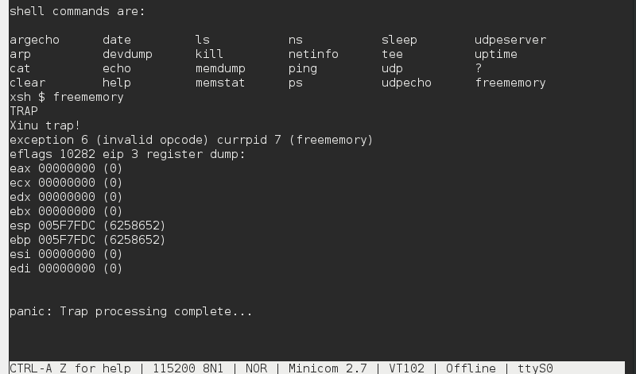

# <h1 align="center">Laporan Praktikum Modul 11 Memori Xinu</h1>

Haikal Fadhilah Mufid - 2311104027

## Dasar Teori

Pada Xinu, memori dibagi menjadi beberapa bagian yaitu text segment untuk menyimpan kode program, data segment untuk global variable yang sudah
diinisialisasi, bss segment untuk global variable yang belum diinisialisasi, dan free space untuk alokasi memori dinamis. Saat Xinu berjalan
atau booting, proses-proses baru akan menggunakan free space tersebut secara dinamis.
Free space sendiri digunakan untuk stack dan heap. Stack dipakai untuk function dan proses yang berjalan, serta otomatis dihapus saat proses
selesai. Sedangkan heap digunakan untuk alokasi memori tambahan seperti malloc(), tetapi harus dihapus manual sehingga lebih rawan memory leak
dan fragmentasi.
Xinu mengelola memori menggunakan linked list bernama memlist yang menyimpan informasi block memori kosong, seperti alamat awal dan ukuran
block. Saat ada proses meminta memori, Xinu akan mencari block kosong yang sesuai lalu mengupdate daftar memori tersebut.

## Guided

Memory management itu penting dipahami programmer karena berhubungan langsung dengan bagaimana program berjalan, bagaimana data disimpan, dan
bagaimana performa program bisa dioptimalkan. Dalam bahasa C, memori program dibagi menjadi beberapa bagian atau segmen, dan setiap segmen punya
tugas masing-masing untuk menyimpan jenis data tertentu.
Secara umum, memori dibagi menjadi text segment, data segment, heap, dan stack. Data segment sendiri masih dibagi lagi menjadi initialized data
dan uninitialized data atau biasa disebut BSS.
Text segment atau code segment adalah bagian yang menyimpan instruksi program yang akan dijalankan. Isi segment ini berupa kode hasil compile
dan biasanya bersifat read-only, jadi program tidak bisa mengubah instruksinya sendiri saat sedang berjalan. Selain kode program, string litera
juga biasanya disimpan di bagian ini.
Lalu ada initialized data segment yang digunakan untuk menyimpan variable global dan static yang sudah diberi nilai awal. Karena nilainya sudah
diketahui sejak awal, data tersebut langsung disimpan di file executable program. Segment ini ukurannya tetap dan datanya masih bisa diubah saat
runtime.
Berbeda dengan itu, BSS segment digunakan untuk variable global atau static yang belum diberi nilai awal. Semua data di bagian ini otomatis
diisi nol oleh sistem. Pemisahan ini dibuat supaya ukuran executable lebih hemat. Misalnya ada array global berisi ratusan ribu elemen kosong,
maka sistem tidak perlu menyimpan semua angka nol di executable, cukup menyimpan informasi ukuran array saja lalu nanti diisi nol saat program
dijalankan.
Selanjutnya ada heap, yaitu area memori untuk data yang sifatnya dinamis. Heap bisa bertambah atau berkurang ukurannya selama program berjalan.
Programmer mengatur heap secara manual menggunakan fungsi seperti malloc() dan free() di C atau new dan delete di C++. Heap biasanya dipakai
untuk struktur data dinamis seperti linked list, tree, atau array yang ukurannya belum diketahui saat compile. Karena pengelolaannya manual,
heap juga rawan menyebabkan memory leak atau error kalau tidak digunakan dengan benar.
Terakhir ada stack, yaitu bagian memori yang digunakan untuk function call, local variable, dan parameter function. Stack bekerja seperti
tumpukan, jadi data yang terakhir masuk akan keluar lebih dulu atau disebut konsep LIFO (Last In First Out). Saat sebuah function dipanggil,
semua local variable dan parameter function akan dimasukkan ke stack. Setelah function selesai, data tersebut otomatis dibuang dari stack.
Penggunaan stack sangat cepat dan otomatis diatur sistem, tetapi kapasitasnya terbatas sehingga kalau terlalu banyak penggunaan bisa menyebabkan
stack overflow.
Intinya, pembagian memori ini dibuat supaya program bisa berjalan lebih teratur, efisien, dan mudah dikelola oleh sistem operasi maupun
programmer. Dengan memahami struktur memori seperti ini, programmer biasanya jadi lebih mudah memahami alur program, melakukan debugging, dan
menghindari masalah seperti crash atau kebocoran memori.

## UnGuided

1. 

2. 
a. mengapa xinu memisahkan data segmen dan BSS segmen adalah untuk efisiensi ukuran file eksekusi, yang dimana data segmen itu dipake buat
menyinmpan variabel global atau statis yang sudah diinisialisasi dengan nilai tertentu oleh programmer, kemudian pada BSS segmen digunakan untuk
menyimpan variabel global atau statis yang belum diinisialisasi

b. alokasi memori akan mengurangi free space karena sistem mengambil atau membagi block kosong untuk digunakan proses, sedangkan dealokasi
memori akan menambah free space kembali dengan mengembalikan block tersebut ke free list dan dapat digabungkan dengan block kosong lain agar 
menjadi lebih besar.

c. Hal ini karena manajemen memori pada heap dilakukan secara manual oleh programmer, sedangkan stack dikelola secara otomatis oleh sistem/
kompilator. Stack Bekerja dengan prinsip LIFO. Saat fungsi dipanggil, memorinya dialokasikan otomatis, dan saat fungsi selesai, memorinya 
langsung dibebaskan otomatis tanpa campur tangan programmer, sedangkan Heap Programmer harus secara eksplisit meminta alokasi dan mengembalikan 
dealokasi memori.

d. Struktur Linked List sangat efisien dan fleksibel untuk menangani memori yang letaknya acak atau tersebar.

e. Tantangan terbesarnya adalah Fragmentasi Eksternal, Seiring berjalannya waktu, proses alokasi dan dealokasi dengan ukuran yang berbeda-beda akan membuat area heap terpecah menjadi blok-blok kosong yang sangat kecil dan tersebar.

## Referensi

1. https://en.wikipedia.org/wiki/Data_structure (diakses blablabla)
2. https://www.youtube.com/watch?v=2htbIR2QpaM
3. https://telkomuniversityofficial-my.sharepoint.com/personal/maghaz_student_telkomuniversity_ac_id/_layouts/15/onedrive.aspx?id=%2Fpersonal%2Fmaghaz_student_telkomuniversity_ac_id%2FDocuments%2F2026%2F00.+Modul+Praktikum+Sistem+Operasi+SE+2526-2.pdf&parent=%2Fpersonal%2Fmaghaz_student_telkomuniversity_ac_id%2FDocuments%2F2026&ga=1 