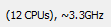
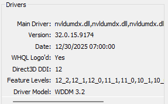
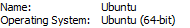
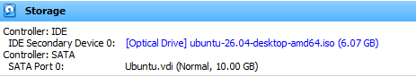

# <h1 align="center">Laporan Praktikum Modul 12   Linux dan Windows</h1>

Haikal Fadhilah - 2311104027

## Dasar Teori
Sistem operasi adalah komponen perangkat lunak dari sebuah sistem komputer yang bertanggung 
jawab untuk mengatur dan mengkoordinasikan aktivitas-aktivitas dan pembagian resource komputer. 
Sistem operasi bertindak sebagai host dari program aplikasi yang berjalan di mesin. Sistem operasi 
menawarkan berbagai service bagi program aplikasi dan pengguna. Aplikasi mengakses service ini 
melalui application programming interfaces (APIs) atau system calls. Dengan menggunakan interface
ini, aplikasi dapat meminta service dari sistem operasi, melewatkan parameter, dan menerima hasil 
dari suatu operasi

## Guided

screenshot dll ngapa gitu

## Jurnal
1. Sistem Operasi adalah perangkat lunak utama yang mengatur kerja komputer atau perangkat agar pengguna bisa menjalankan aplikasi dan menggunakan hardware dengan mudah.

2. 
a. Windows 11 Home Single Language 64 bit (10.0, build 26200)

b. 64 bit

c. 3.3Ghz

d.  

3. Windows yang terpasang adalah win 11 dengan versi 26200, kelebihannya adalah tidak ada kelebihan.

4. 
a. Linux Ubuntu

b. 64 bit

c. total 10gb, terpakai 6.07 gb

d. 1 partisi saja

5. ubuntu, fedora, mint, manjaro, debian

6. pada praktikum kali ini ssaya sudah menggunakan 4 jenis operasi sistem, 3 nya linux, 1 nya windows.
linuxnya adalah xinu, ubuntu, dan manjaro.

7. yang mudah digunakana adalah tetap windows, walau tidak memiliki kelebihan yg signifikan, tetapi mudah digunakan untuk kebuthan sehari hari.
linux tetap enak, cuma sayangnya beberapa aplikasi tidak fully support.

## Referensi

1. https://en.wikipedia.org/wiki/Data_structure 
