# <h1 align="center">Laporan Praktikum Modul 13   Perintah Dasar Linux</h1>

Haikal Fadhilah - 2311104027

## Dasar Teori
Pada umumnya default perintah dasar Linux dieksekusi pada Bash (/bin/bash). Bash mengeksekusi 
program dalam OS untuk setiap perintah yang dimasukkkan dalam console
Perintah–perintah di console Linux memiliki aturan–aturan penulisan, aturan struktur penulisan 
perintah Linux tersebut berlaku pada hampir semua perintah–perintah Linux. Penulisan perintah Linux 
bersifat case sensitive artinya adalah setiap penulisan huruf besar dan kecil sangat berpengaruh 
terhadap hasil yang diinginkan.

## Guided

## Jurnal

1. 
    a. 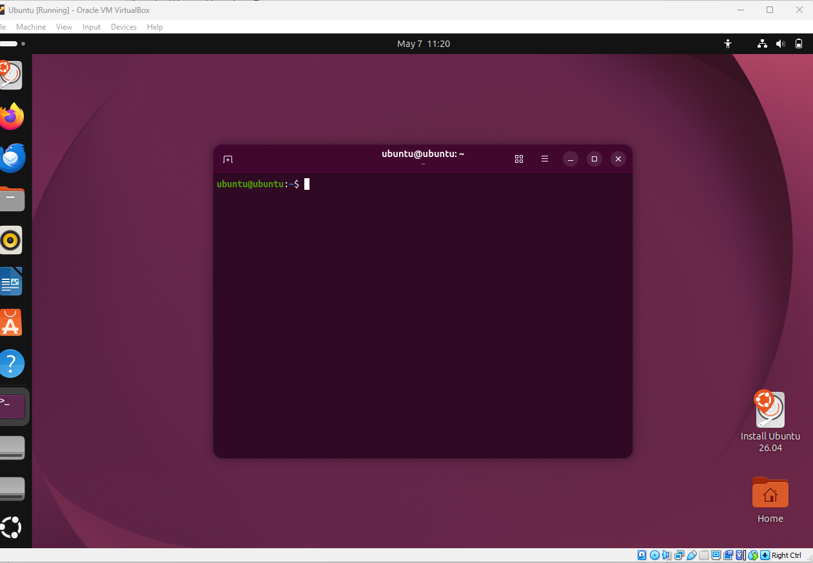
    b. command ls pada debian ini untuk menampilkan list list file pada file manager
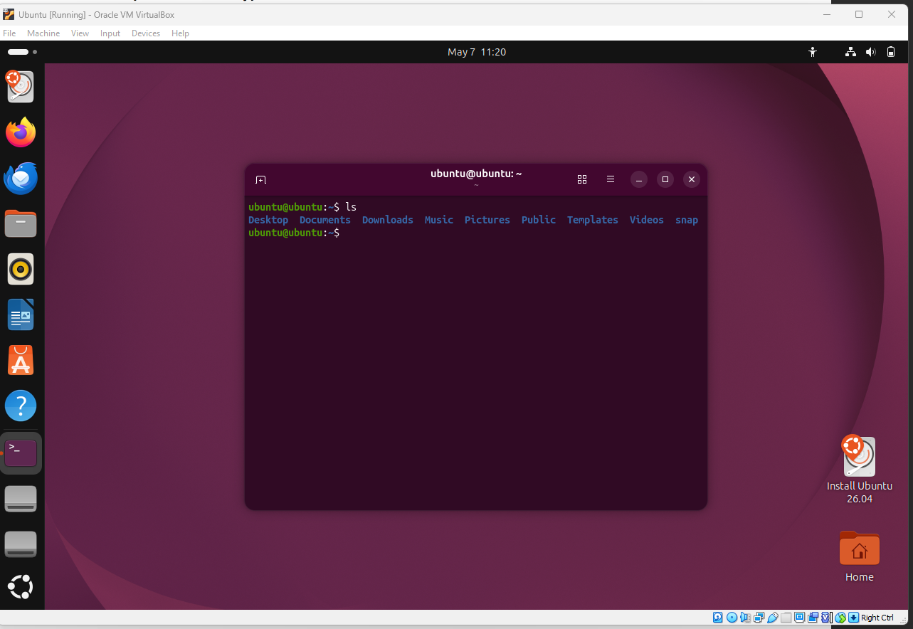

2.  
    a. 
    b. option dari perintah diatas antara lain adalah Dekstop, Documents, Downloads, music dll.
    c. fungsi dari ls adalah untuk menampilkan list list file pada file manager.
    d. 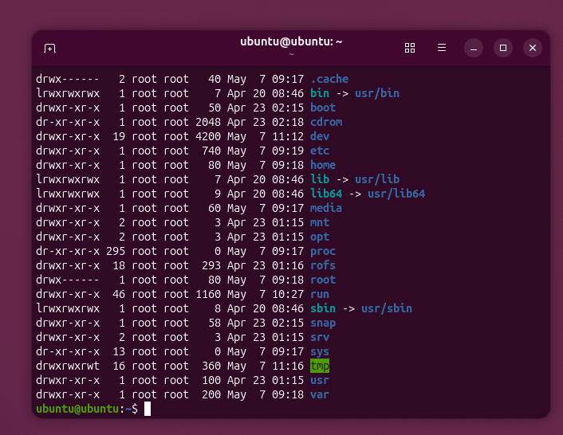
    e. banyak sekali option pada perintah tsb
    f. fungsi dari perintah tsb adalah menampilkan semua direktori root secara lengkap.
    g. karena perintah ls hanya menampilkan secara mendasar saja, yang bisa dilihat oleh user, sedangkan ls -all menampilkan semuanya secara lengkap, termasuk file file sistem berekstensi, sedangkan ls biasa hanya menampilkan tertentu saja seperti folder.
    
3.  a. 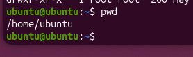
    b. perintah pwd tidak memiliki option
    c. fungsi dari pwd adalah untuk menampilkan path ubuntu.

4.  a. 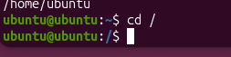
    b. tidak ada option dari perintah tersebut
    c. yang dilakukan perintah cd adalah untuk masuk ke direktori tertentu pada file manager. sbg contoh "cd Desktop" 

5.  a. perintah cd / untuk kembali ke direktori awal sebelum masuk ke manapun, sedangkan untuk cd ~ adalah untuk mengembalikan path direktori ke arah semula 
    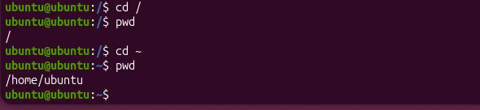
    b. Untuk berpindah dari /proc/self ke /, perintah cd .. harus dijalankan sebanyak 2 kali.Pertama dari /proc/self ke /proc, kedua dari /proc ke /.
    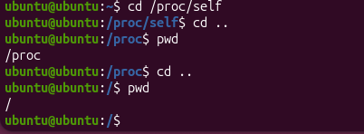

6.  a & b 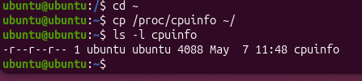
    c & d 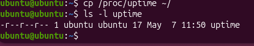
    e & f 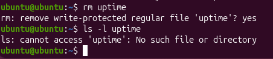
    g. 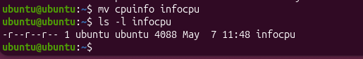

7.  a & b 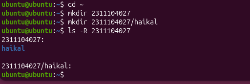

8.  a. 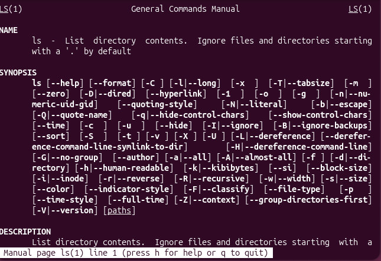
    b. fungsi ls adalah menampilkan informasi atau daftar file dan direktori. 
    c. Pencipta perintah ls adalah Richard M. Stallman dan David MacKenzie.
    d. Option -h berarti human-readable, yaitu menampilkan ukuran file dalam format yang mudah dibaca, seperti K, M, atau G.
    e. Option yang digunakan adalah -R.
    f. 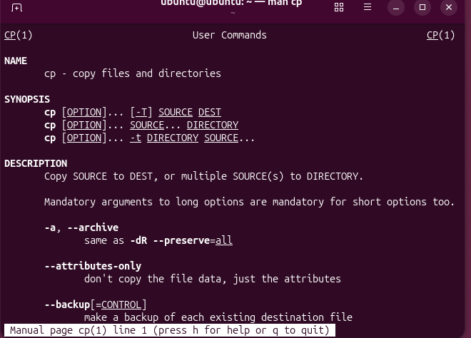
    g. fungsi man cp adalah untuk menyalin file atau direktori.
    h. Pencipta perintah cp adalah Torbjorn Granlund, David MacKenzie, dan Jim Meyering.
    i. Option -v berarti verbose, yaitu menampilkan proses penyalinan file yang sedang dilakukan.
    j. Option yang digunakan adalah -i.

9.  a. 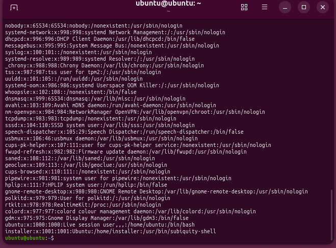
    b. Perintah cat berfungsi untuk menampilkan isi file ke layar terminal.
    c. 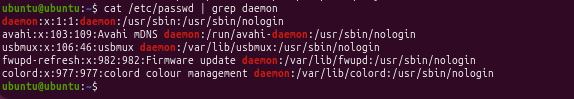
    d. 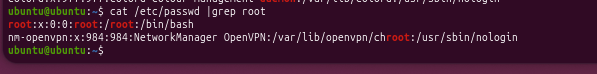
    e. 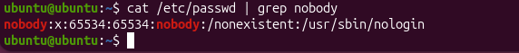    
    f. Fungsi | grep daemon adalah memfilter output dari perintah sebelumnya dan hanya menampilkan baris yang mengandung kata daemon.

10. a. 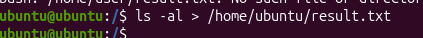
    b. dibagian file manager di bagian "Home" akan muncul file result.txt
    c. 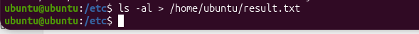
    d. Tanda > berfungsi untuk mengalihkan output dari perintah ke dalam file. Jika file belum ada, file akan dibuat. Jika file sudah ada, isi file lama akan ditimpa dengan output yang baru.

II KOMPILASI KODE

1. 
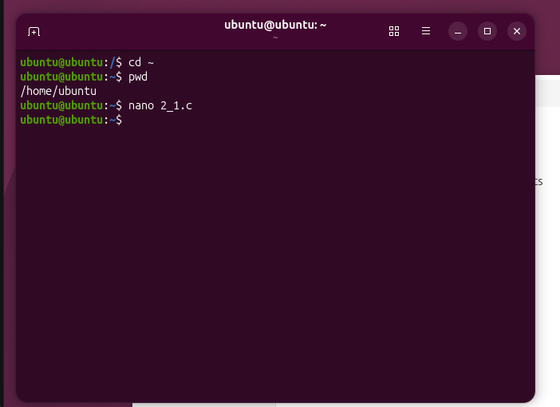
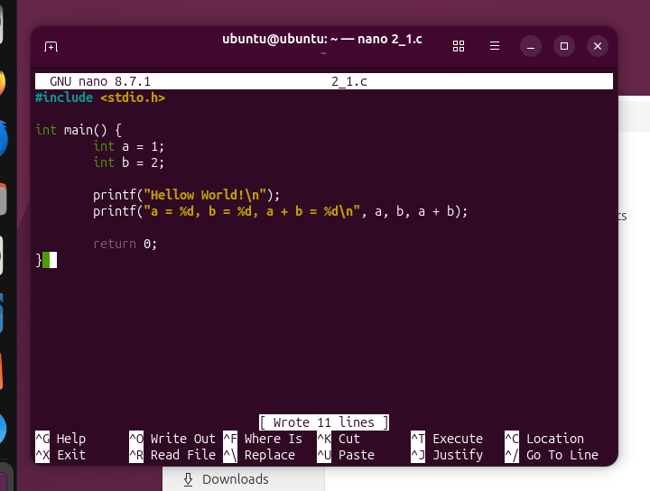

2. 
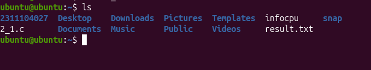

3. 
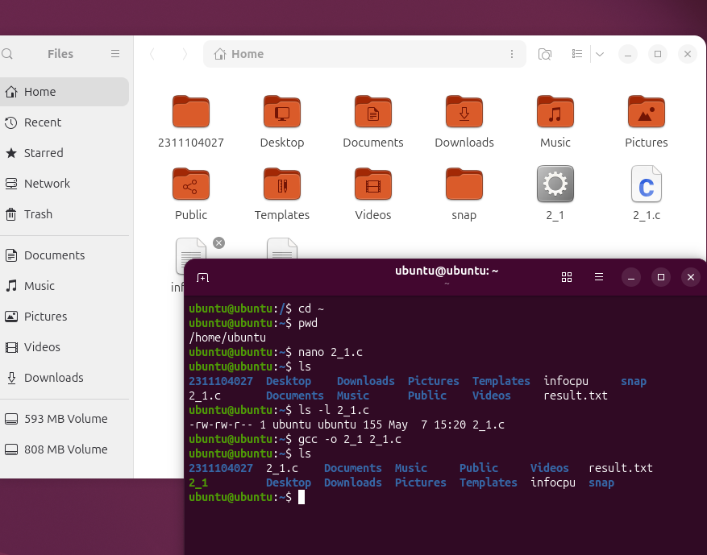
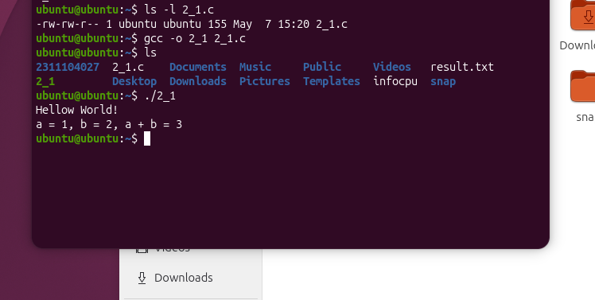
    
4. 
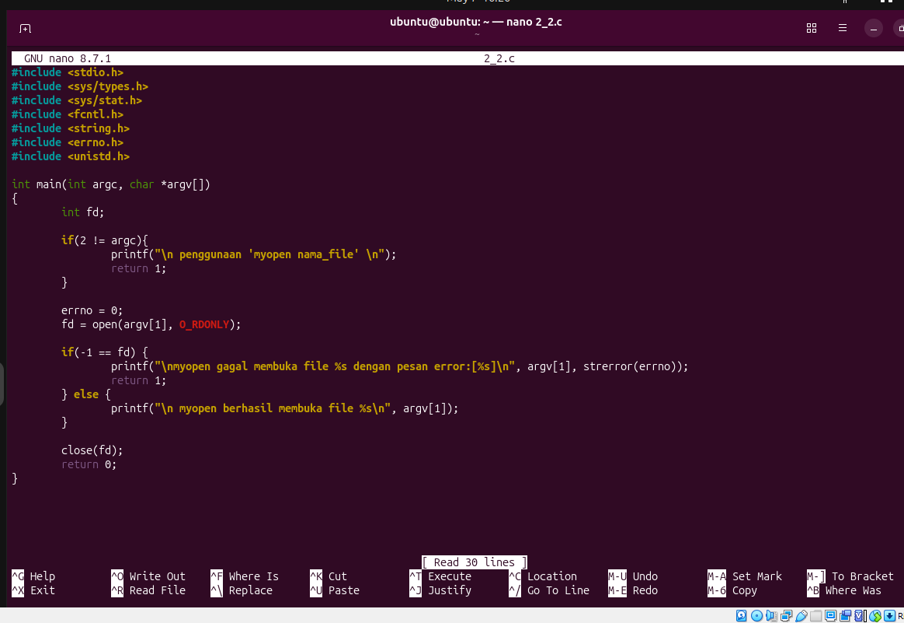

5 & 6
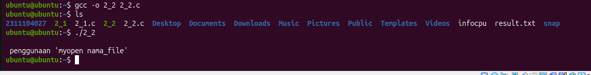

7. Program myopen digunakan untuk mencoba membuka sebuah file dalam mode read-only atau hanya baca. Program menerima satu input berupa nama file saat dijalankan. Jika file berhasil dibuka, program akan menampilkan pesan bahwa file berhasil dibuka. Jika file gagal dibuka, misal karena file tidak ada, program akan menampilkan pesan gagal beserta keterangan error.

    
## Referensi

1. https://en.wikipedia.org/wiki/Data_structure (diakses blablabla)