# <h1 align="center">Laporan Praktikum Modul 14   Scripting </h1>

Haikal Fadhilah - 2311104027

## Dasar Teori

Bash (Bourne-Again Shell) adalah unix shell (command line interpreter/command line user interface) 
yang ditulis oleh Brian Fox sebagai pengganti dari Bourne shell. Bash adalah command processor yang 
biasanya berjalan mode text dimana user mengetikkan perintah di layar untuk kemudian dieksekusi 
oleh komputer. Bash dapat juga membaca dan mengeksekusi perintah dari file yang disebut bash 
script.

## Guided

## Jurnal
1. 
a. Pembuatan Greeting.sh
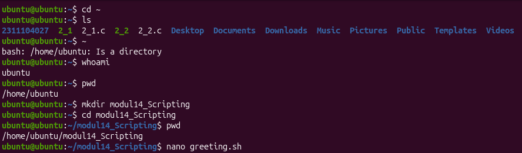

b. 
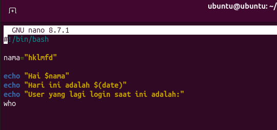

Hasilnya adalah
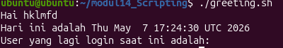

2. 
a. Pembuatan greeting_1.sh
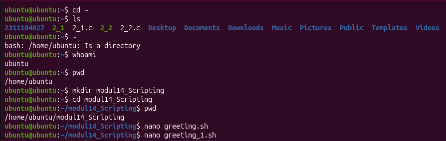

b.
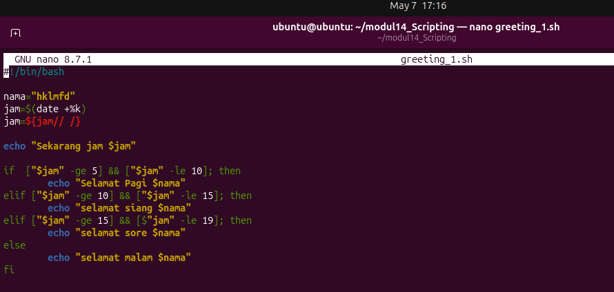

Hasilnya adalah
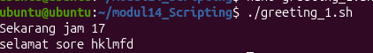

3. 
a. Pembuatan countdown.sh
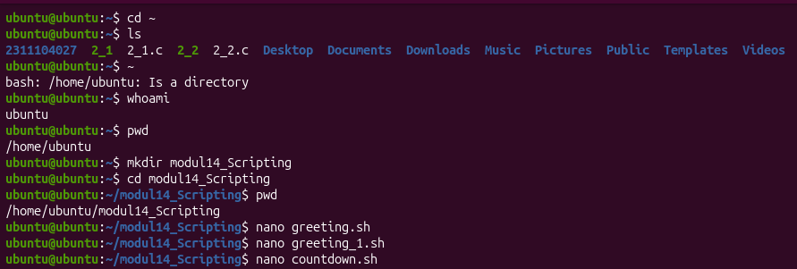

b.
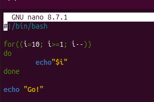

Hasilnya adalah
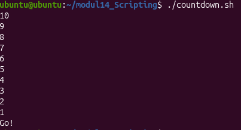

4. Pembuatan countdown_1.sh
a. 
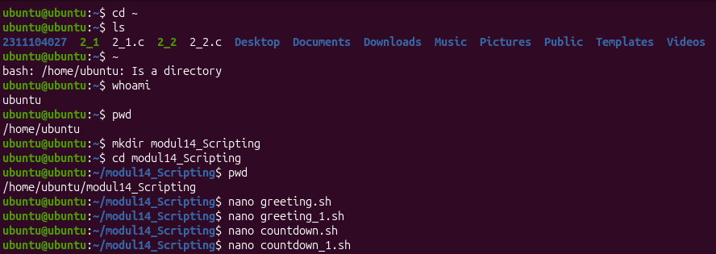

b. 
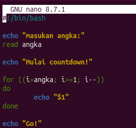

hasilnya adalah:
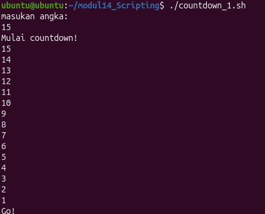

5. 
a. Pembuatan countdown_2.sh
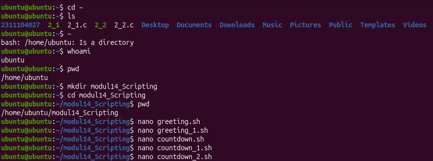

b.
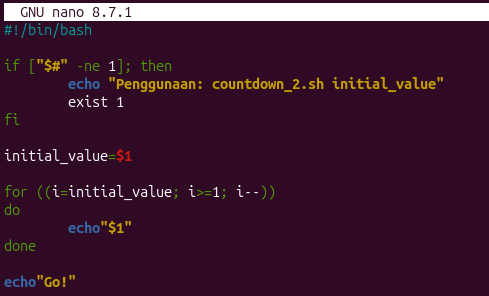

Hasilnya adalah:
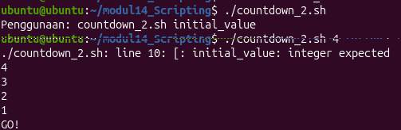

6. 
a. Pembuatan list_direktori.sh
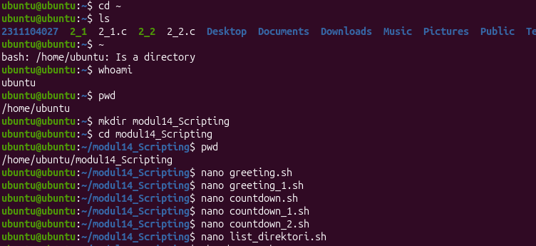

b.
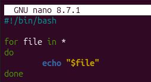

kemudian melakukan perizinan agar sh dapat tampil dengan command seperti ini
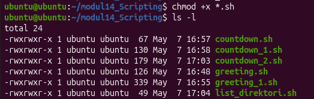

Hasilnya adalah
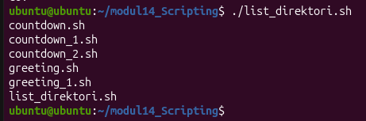

## Referensi

1. https://en.wikipedia.org/wiki/Data_structure 
2. https://telkomuniversityofficial-my.sharepoint.com/personal/maghaz_student_telkomuniversity_ac_id/_layouts/15/onedrive.aspx?id=%2Fpersonal%2Fmaghaz_student_telkomuniversity_ac_id%2FDocuments%2F2026%2F00%2E%20Modul%20Praktikum%20Sistem%20Operasi%20SE%202526-2%2Epdf&parent=%2Fpersonal%2Fmaghaz_student_telkomuniversity_ac_id%2FDocuments%2F2026&ga=1
3. GPT (buat debug bash soalnya error terus cuy)