# <h1 align="center">Laporan Praktikum Modul 15   Keamanan</h1>

Haikal Fadhilah - 2311104027

## Dasar Teori

Linux adalah sistem operasi multi-user yang mengamankan sistemnya lewat aturan kepemilikan dan hak akses (permission) pada setiap file. Di dalamnya terdapat pengguna biasa untuk aktivitas interaktif, pengguna sistem untuk proses latar belakang, dan superuser (root) yang memegang kendali penuh atas seluruh sistem, di mana daftar lengkapnya bisa dilihat di file /etc/passwd. Demi keamanan, tugas administratif biasanya diserahkan kepada pengguna biasa yang diberi hak akses sudo. Selain itu, pengguna juga bisa dikelompokkan ke dalam satu atau lebih grup yang daftarnya tercatat di file /etc/group. Pada akhirnya, setiap file di Linux pasti terikat pada satu pengguna dan satu grup spesifik yang menentukan siapa saja yang berhak mengakses file tersebut.

## Jurnal

1. 
a. 
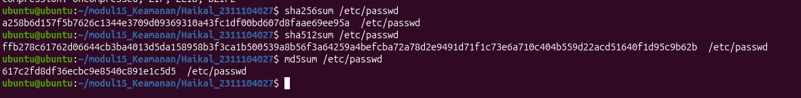

b. 
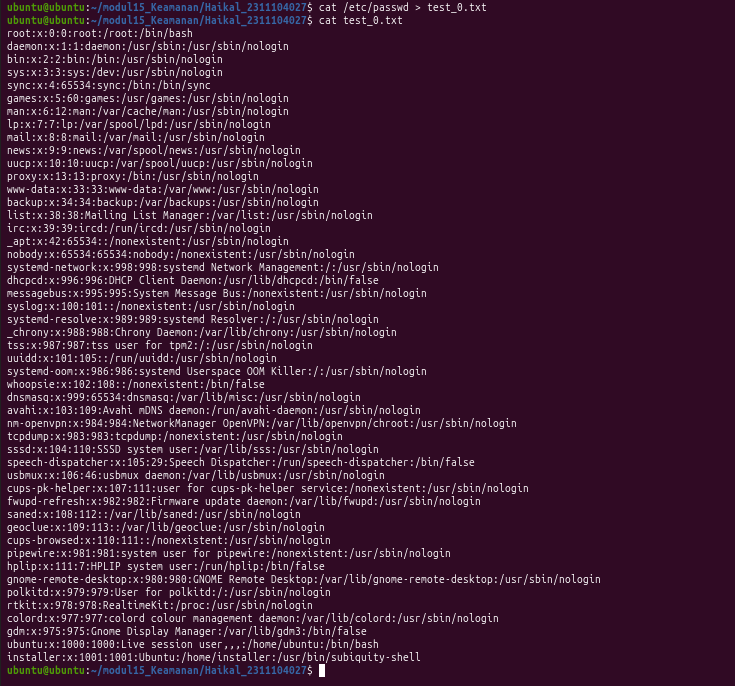

c. 
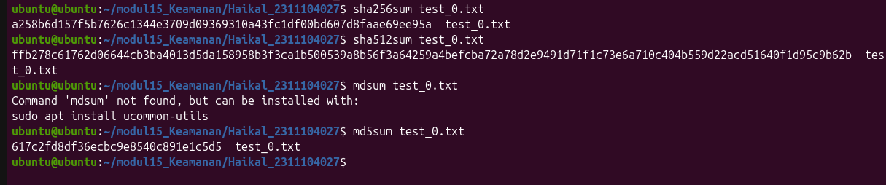

d. 
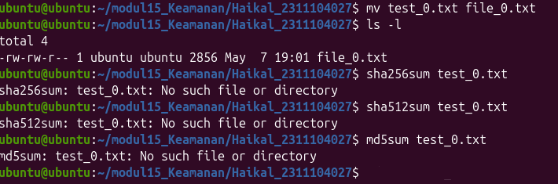

Berdasarkan hasil pengujian, file /etc/passwd, test_0.txt, dan file_0.txt punya nilai hash yang sama jika isi file tidak berubah. Hal ini terjadi karena fungsi hash menghitung nilai berdasarkan isi atau konten file, bukan berdasarkan nama file.
File test_0.txt merupakan salinan dari isi /etc/passwd, sehingga nilai hash SHA256, SHA512, dan MD5 sama dengan file /etc/passwd. Setelah test_0.txt diubah namanya menjadi file_0.txt, nilai hash tetap sama karena proses rename hanya mengubah nama file, bukan isi file.
Kesimpulannya, file yang mempunyai hash sama adalah /etc/passwd, test_0.txt, dan file_0.txt, selama isi ketiga file tersebut benar-benar sama.

2. 
a.
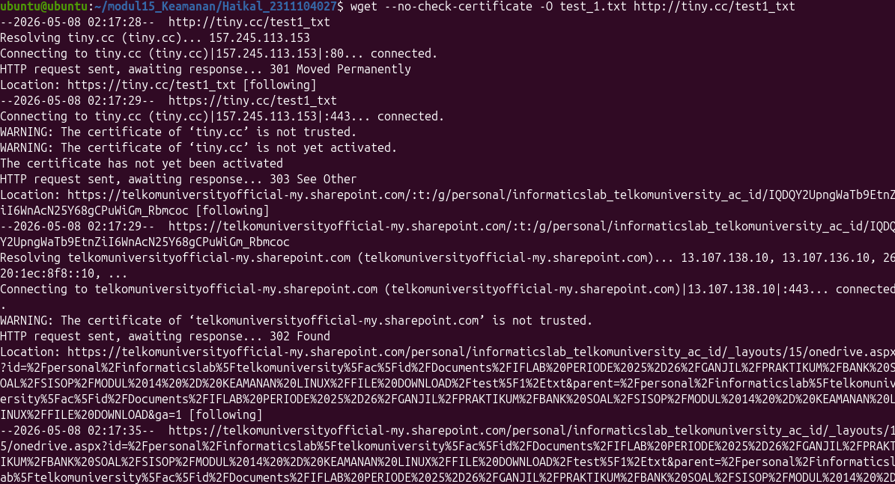

b. 
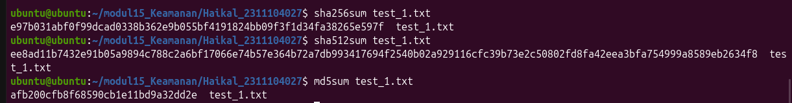

c. 
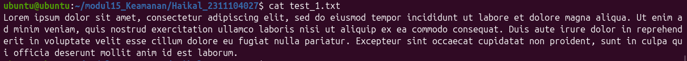

d.
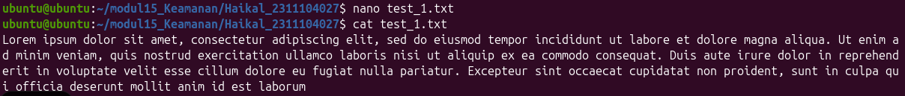

e.
Kesimpulannya, nilai hash sebelum dan sesudah perubahan tidak sama karena isi file telah berubah, walaupun perubahan tersebut hanya satu karakter.

3. 
a. Download manual menggunkan browser
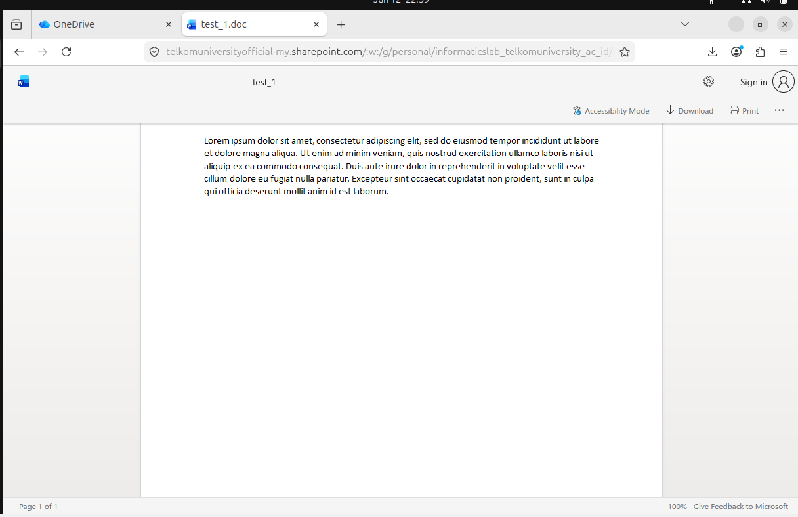

b. 
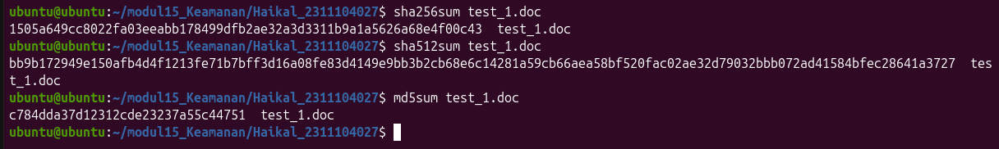

c. 
input abcdef dan save
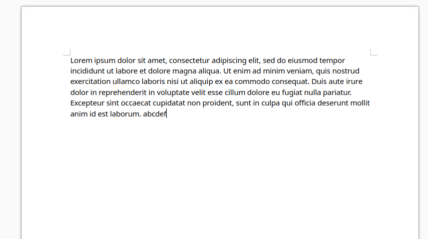
hapus dan save
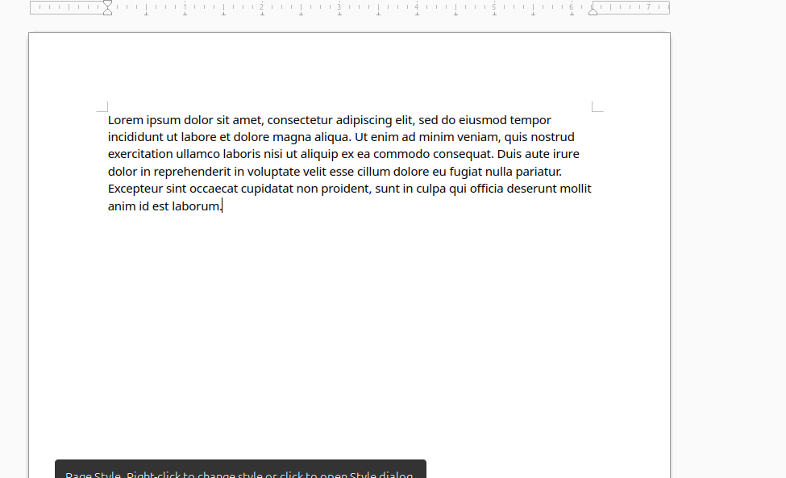

d. 
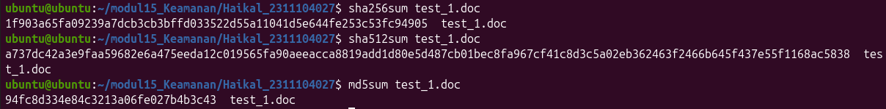

e. 
nilai hash test_1.doc sebelum dan sesudah proses edit-save tidak sama karena hash menghitung keseluruhan isi biner file, bukan hanya teks yang terlihat oleh pengguna.

4. 
a. 
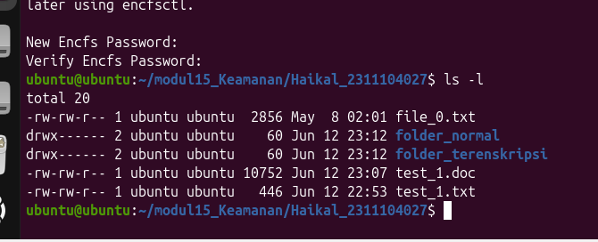

b. 
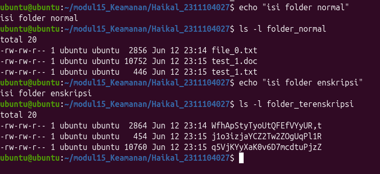
Setelah beberapa file disalin ke folder_normal, file tersebut muncul dengan nama asli di folder_normal. Namun, pada folder_terenkripsi, file yang muncul tidak lagi berbentuk seperti file asli. Nama file terlihat berubah/acak dan isi file tidak dapat dibaca secara langsung. Hal ini menunjukkan bahwa EncFS menyimpan data dalam bentuk terenkripsi pada folder_terenkripsi, sedangkan folder_normal hanya menjadi tampilan file yang sudah didekripsi.

c. setelah melakukan penghapusan pada folder terenskripsi
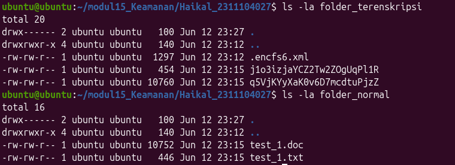

d. 
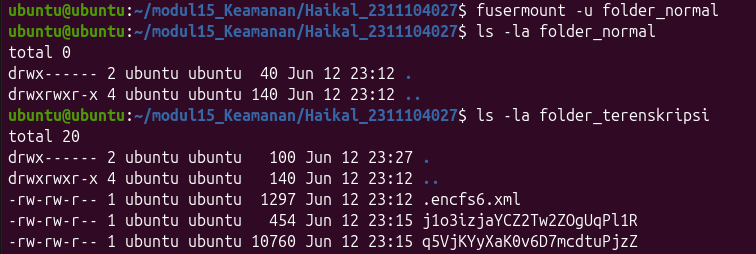

e.
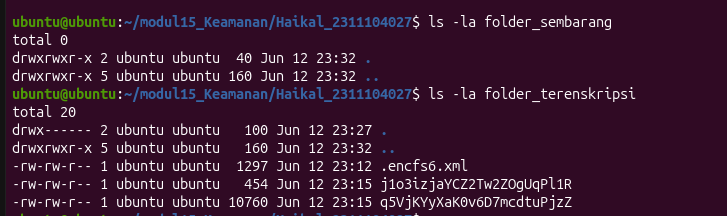
Setelah folder_terenkripsi dimount ke folder_sembarang menggunakan password yang benar, file asli dapat terlihat kembali melalui folder_sembarang. Hal ini menunjukkan bahwa folder_terenkripsi menyimpan data dalam bentuk terenkripsi, sedangkan folder_sembarang berfungsi sebagai folder hasil dekripsi. Folder terenkripsi dapat dibuka melalui folder mount lain selama menggunakan sumber folder_terenkripsi dan password yang sesuai.

5. 
a. 
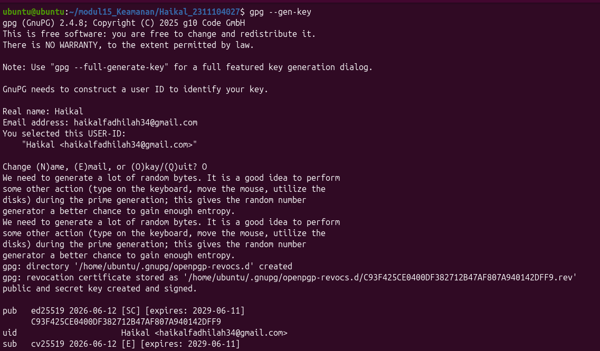

b. 
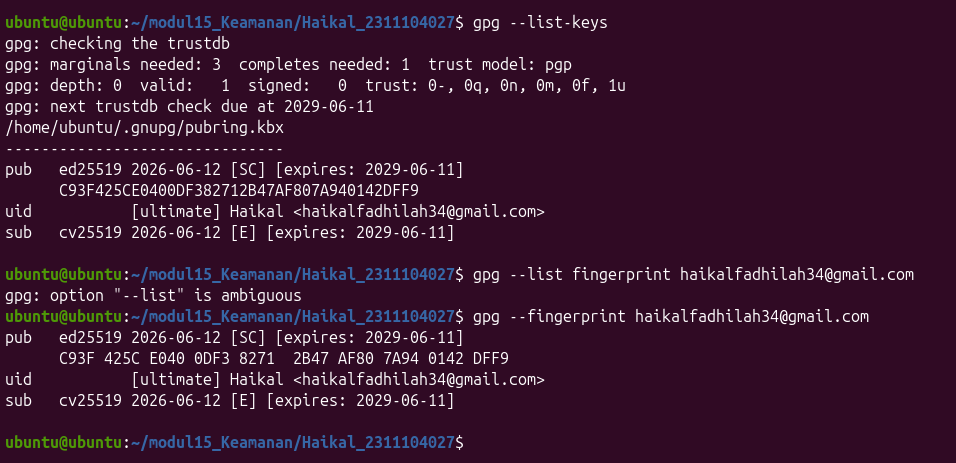

c. 
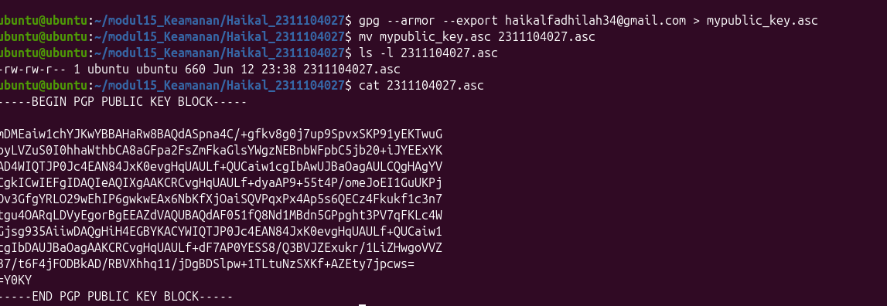

d. 

e. 
## Referensi

1. https://en.wikipedia.org/wiki/Data_structure 
2. https://telkomuniversityofficial-my.sharepoint.com/personal/maghaz_student_telkomuniversity_ac_id/_layouts/15/onedrive.aspx?id=%2Fpersonal%2Fmaghaz_student_telkomuniversity_ac_id%2FDocuments%2F2026%2F00%2E%20Modul%20Praktikum%20Sistem%20Operasi%20SE%202526-2%2Epdf&parent=%2Fpersonal%2Fmaghaz_student_telkomuniversity_ac_id%2FDocuments%2F2026&ga=1